# Proyecto de evaluación

---


---

## Estudiante: Juan Carlos González Ibarra
## Correo Institucional: jcarlos0284@gmail.com

---

## Fecha: 17 de mayo 2024

---

## Contenido

1.	Tema

2.	Metodología de Desarrollo

3.	Extracción de Datos

4.	Data Clean

5.	Modelado de Datos

6.	Análisis exploratorio de Datos (AED)

8.	Conclusión

9.	Bibliografía


---

## 1. Tema

### 1.1 Planteamiento del problema
La industria de los videojuegos ha experimentado un crecimiento significativo, impulsado por la popularidad de los videojuegos como formas de entretenimiento digital y el aumento en el número de jugadores. Sin embargo, este crecimiento presenta desafíos importantes. La constante evolución de los videojuegos, impulsada por avances tecnológicos y cambios en los hábitos de consumo, ha creado incertidumbre sobre cómo anticipar y adaptarse a las demandas cambiantes del mercado.
Además, el lapso de la pandemia y las medidas de confinamiento incremento esta tendencia, con un aumento notable en el número de jugadores que utilizan plataformas como Nintendo, Xbox y Playstation. Este cambio en el comportamiento de los consumidores ha llevado a un aumento del 6,3% en el número de usuarios de consolas digitales en Estados Unidos. La proliferación de smartphones y el desarrollo de tecnologías como la realidad virtual han ampliado aún más el acceso a los videojuegos, atrayendo a una nueva generación de jugadores.
En este contexto de intensa competitividad y demanda creciente de innovación, las empresas del sector enfrentan el desafío de mantenerse al día con las expectativas del público y encontrar formas innovadoras de ofrecer experiencias de juego únicas y atractivas. La idea del “metaverso” surge como una posible solución, ofreciendo un mundo virtual en el que los usuarios pueden crear y compartir sus propias experiencias. 

Por lo anterior, el proyecto plantea desarrollar una herramienta de predicción que pueda identificar con precisión qué estilos de videojuegos tienen el potencial de éxito.

### 1.2 Objetivos

•	Plantear un método de desarrollo para la extracción, limpieza, almacenamiento y análisis de datos de videojuegos exitosos y no exitosos, considerando variables como género, plataforma de lanzamiento, reseñas de usuarios, ventas, entre otros.

•	Diseñar un modelo predictivo basado en machine learning que pueda predecir el potencial de éxito de un videojuego en función de sus características específicas.

•	Evaluar la eficacia del modelo de predicción mediante la comparación de las predicciones con el desempeño real de los videojuegos.

---

## 2. Metodología de Desarrollo

Para realizar el proyecto se desarrollarán módulos de código para cada uno de los puntos planteados en los objetivos para que se pueda permitir establecer las variables del tipo de Genero y/o Plataforma del Videojuego a desarrollar y poder determinar (experimentalmente) la predicción de ventas de ese videojuego tomando como referencia la variable copia de ventas del videojuego, así que, se va trabajar cada tarea de la siguiente forma:

- Investigar las fuentes donde se puede obtener los datos para el proyecto.
- Extraer los datos vía Web Scraping
- Data Clean:
    - Carga de Datos
    - Preprocesar los datos.
    - Eliminar variables irrelevantes.
    - Imputar valores faltantes.
    - Limpiar los nombres de los atributos que no se vayan a utilizar.

- Almacenar los datos en un sistema de base de datos
- Definición de la(s) Variable(s) Objetivo(s).
- Generar un Modelo Predictivo Supervisado con Algoritmo de:

    - Regresión: Este algoritmo puede predecir un valor continuo (como las ventas globales de un videojuego). Se trata de encontrar una relación entre las variables de entrada y la variable de salida que puede ser representada como una ecuación matemática. Los algoritmos de regresión son: regresión lineal, la regresión polinomial y la regresión de árbol de decisión.

    - Clasificación: Este algoritmo puede predecir una categoría o clase (como el género de un videojuego). Se trata de encontrar una frontera de decisión que separe las diferentes clases en el espacio de las variables de entrada. Los algoritmos de clasificación son: regresión logística, los árboles de decisión, las máquinas de vectores de soporte y las redes neuronales.

    - Predicción: Este algoritmo se utiliza para predecir. La diferencia radica en el tipo de variable de salida que se trata de predecir.

- Evaluar el modelo.
- Implementar el modelo.
- Realizar un Análisis Exploratorio de los Datos para entender la distribución de las variables para conseguir el objetivo del proyecto:

    - Análisis de Correlación de Ventas Globales por Consola y Genero.
    - Análisis de Ventas Globales de Videojuegos por Plataforma.
    - Análisis de Ventas Globales por Género.
    - Análisis de Ventas Globales por Compañía de Desarrollo.

---

### 3.2 Que es la extracción de datos

La extracción de datos es un proceso crucial para cualquier organización que desee aprovechar al máximo su información para la toma de decisiones. Permite recuperar datos de diversas fuentes y transformarlos en un formato utilizable para su posterior análisis o almacenamiento. Los datos pueden provenir de bases de datos, hojas de cálculo, sitios web, archivos PDF, correos electrónicos, entre otros.

La extracción de datos se puede utilizar para descubrir patrones o relaciones ocultas dentro de los datos para tomar decisiones informadas o crear modelos predictivos.

La metodología de la extracción de datos implica los siguientes pasos:

- Identificación de fuentes de datos: Determinar de dónde provienen los datos necesarios y qué método utilizar para cada fuente, como consultas SQL, APIs o software de web scrapping.

- Establecimiento de conexiones: Establecer conexiones con las fuentes de datos seleccionadas utilizando métodos específicos según el tipo de fuente.

- Consulta o recuperación de datos: Recuperar datos específicos utilizando consultas SQL, extracción de texto mediante OCR u otras técnicas según sea necesario.

- Transformación y carga de datos: Transformar los datos extraídos para cumplir con el formato requerido, incluyendo la limpieza de datos, la normalización y el enriquecimiento, y guardarlos en un destino, como archivos planos o bases de datos.

Para este paso se utilizará la técnica de web scraping con el lenguaje de programación Python versión 3.
El web scraping es una técnica utilizada para extraer datos de sitios web de manera automatizada. Permite recopilar información de páginas web de forma sistemática, convirtiendo los datos no estructurados en un formato estructurado y utilizable. 

Para realizar web scraping en Python, hay varias bibliotecas útiles disponibles son:

- **Beautiful Soup**: Es una biblioteca Python que se utiliza para extraer datos de archivos HTML y XML. Proporciona métodos simples para navegar y buscar en el árbol de análisis, lo que la hace muy útil para la extracción de datos de páginas web.

- **Requests**: Aunque no es específicamente una biblioteca de web scraping, Requests es una biblioteca HTTP para Python que permite realizar solicitudes HTTP de manera sencilla. Es muy útil para descargar el contenido HTML de una página web antes de aplicar técnicas de web scraping con Beautiful Soup.

- **Selenium**: Es una herramienta poderosa para automatizar navegadores web. Puede ser útil para interactuar con páginas web que requieren JavaScript para cargar o realizar acciones dinámicas. Selenium puede controlar un navegador web y simular la interacción del usuario.

---
### 3.3 Extracción de datos con Python
#### 1. Para utilizar estas bibliotecas se ejecutarán los siguientes comandos para instalarlos en el entorno del lenguaje Python:

```python
!pip install pandas
!pip install html5lib
!pip install beautifulsoup4
!pip install requests
!pip install selenium
```
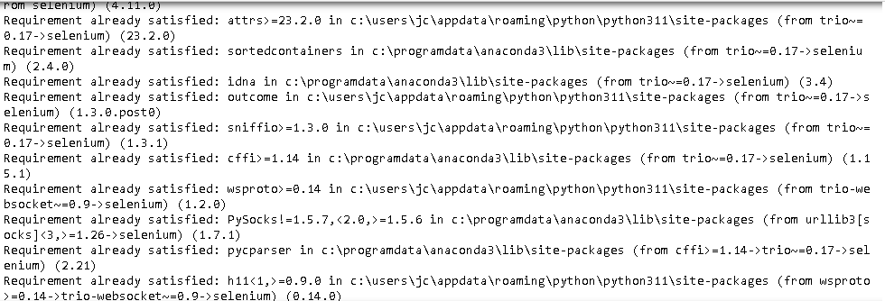

#### 2. Declarar las librerías 

```python
from selenium import webdriver
from bs4 import BeautifulSoup
import pandas as pd
import time
```
#### 3. Se crea un dataframe para almacenar la información que se extraiga.

```python
#Crear un DataFrame vacío para almacenar los datos
all_data = pd.DataFrame()
```

#### 4. Se define el tipo de driver de web browser que se utilizara para obtener la información.

```python
# Especifique la ubicación del driver de Firefox
driver = webdriver.Firefox()
```

#### 5. Se crea un bucle que iterara a través del rango de números de página para extraer datos del sitio web MobyGames. Para cada número de página en el rango especificado, el código construye una URL correspondiente a esa página, realiza una solicitud GET al sitio web utilizando Selenium, espera a que el JavaScript genere la tabla de datos, parsea el contenido HTML de la página utilizando BeautifulSoup, busca la tabla que contiene los datos, y luego se guarda en el DataFrame de Pandas **all_data** a partir de esta tabla. Una vez que itera a través de todas las páginas, cierra el driver de Selenium.


```python
# Iterar a través de un rango de números de página
# Supongamos que hay 10 páginas
for i in range(1, 30):
    # Construir la URL para la página actual
    url = f"https://www.mobygames.com/game/sort:moby_score/page:{i}/"

    # Hacer una petición GET al sitio web
    driver.get(url)

    # Espera que el JavaScript genere la tabla (puede que necesites ajustar el tiempo de espera)
    time.sleep(2)
    
    # Parsear el contenido de la página con BeautifulSoup
    soup = BeautifulSoup(driver.page_source, 'html.parser')
    

    # Buscar la tabla en el contenido de la página
    table = soup.find('table')

    # Crear un DataFrame de Pandas a partir de la tabla
    df = pd.read_html(str(table))[0]

    # Agregar los datos al DataFrame total
    all_data = pd.concat([all_data, df])

# Cerrar el driver de Selenium
driver.quit()
```


#### 6. Visualizar los datos que contiene el Data Frame **all_data**

```python
print(all_data)
```
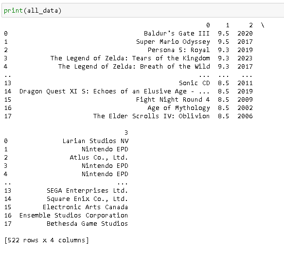

#### 7. Se guardan los datos que contiene el Data Frame all_data en un archivo con extensión csv llamado "consolas.csv"

```python
all_data.to_csv('consolas.csv', index=False)
```

#### 8. Se realiza este mismo proceso con las otras páginas que están como fuentes para tener más de un banco de datos que pueda ayudar a realizar la herramienta de predicción.

Se tiene como resultados los archivos csv: 
  
- 'juegos_mas_vendidos.csv'
- 'consolas.csv'
- 'consolas2.csv'
- 'moby_score.csv'
- 'vgsales.csv'
- 'video_games.csv
    
estos archivos contienen diferente información que llevara a cabo el proceso **Data Clean** para eliminar, normalizar y posterior guardar los datos con las variables necesarias para el análisis exploratorio de los datos.

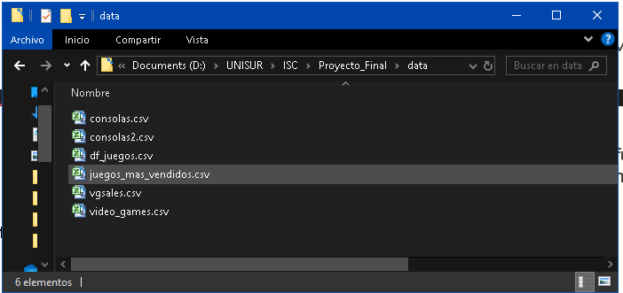

## 4. Data Clean
### 4.1 Descripción de los datos

Los data sets están en formato CSV son:
- consolas.csv
- consolas2.csv
- juegos_mas_vendidos.csv
- vgsales.csv
- video_games.csv

La información que contiene los archivos CSV es la siguiente:

**consolas.csv y consolas2.csv** : Contiene información de las plataformas de videojuego, juegos desarrollados, y críticas.

- Atributos:
    - Platform: Este atributo es de tipo string y describe el nombre de la consola de juegos para la cual se desarrollaron los juegos.
    - Games_x: Este atributo es de tipo entero y representa la cantidad de juegos que se han desarrollado para la consola específica representada en la columna "Platform".
    - Player Reviews: Este atributo es de tipo entero y muestra la cantidad de comentarios o críticas realizadas por los jugadores acerca de la consola.
    - Critic Reviews: Este atributo es de tipo entero y muestra la cantidad de críticas realizadas por críticos profesionales acerca de la consola.
    - Companies: Este atributo también es una combinación de cadena de texto e integer y muestra la cantidad de compañías de desarrollo de videojuegos que han desarrollado títulos para la consola.
    - Years: Este atributo es una cadena de texto con datos enteros que indica el rango de años durante los cuales la consola ha estado en el mercado. Por ejemplo, un valor de "2001 - 2020" indicaría que la consola se lanzó en 2001 y se sigue utilizando hasta 2020.

**juegos_mas_vendidos.csv, vgsales.csv y video_games.csv**: Contiene información de los juegos más vendidos por plataforma, genero, etc., y estadísticas del promedio de tiempo que pasa el jugador jugando.

- Atributos: 
    - 'Titulo': tipo string El nombre del videojuego.
    - 'Compañia de desarrollo': tipo string La empresa o estudio que desarrolló el videojuego.
    - 'Fecha de Lanzamiento': tipo int La fecha en que el videojuego fue lanzado oficialmente al mercado.
    - 'Genero': tipo string El tipo o categoría de juego al que pertenece el videojuego (ej. acción, aventura, estrategia, etc.).
    - 'Plataforma': tipo string El sistema o dispositivo en el que el juego fue lanzado y puede ser jugado (ej. PlayStation, Xbox, PC, etc.).
    - 'Multiplataforma': tipo string Un indicador de si el videojuego está disponible en más de una plataforma.
    - 'Portatil': tipo bool Un indicador de si el videojuego está disponible en plataformas portátiles (ej. Nintendo Switch, PSP, etc.).
    - 'Online': tipo bool Un indicador de si el videojuego tiene funcionalidad de juego en línea.
    - 'Max Jugadores': tipo bool El número máximo de jugadores que pueden jugar el videojuego simultáneamente.
    - 'Rating': tipo int La clasificación de edad o recomendación de edad para el videojuego (ej. E para todos, T para adolescentes, M para maduro, etc.).
    - 'Ranking': tipo int El lugar que ocupa el videojuego en una lista ordenada, generalmente en términos de popularidad o ventas.
    - 'Puntuacion Reseña': tipo float La calificación o puntuación promedio que los críticos de videojuegos han dado al videojuego.
    - 'Secuela': tipo bool Un indicador de si el videojuego es una secuela de un videojuego anterior.
    - 'Licenciado': tipo bool Un indicador de si el videojuego está basado en una licencia existente (ej. una película, una serie de televisión, un cómic, etc.).
    - 'Ventas NA': tipo float La cantidad de copias del videojuego que se han vendido en América del Norte.
    - 'Ventas EU': tipo float La cantidad de copias del videojuego que se han vendido en Europa.
    - 'Ventas JP': tipo float La cantidad de copias del videojuego que se han vendido en Japón.
    - 'Ventas Otros': tipo float La cantidad de copias del videojuego que se han vendido en otras regiones del mundo.
    - 'Ventas Globales': tipo float La cantidad total de copias del videojuego que se han vendido en todo el mundo.
    - 'Ventas Estimadas': tipo float Una estimación de la cantidad total de copias del videojuego que se venderán en el futuro, basada en las tendencias actuales de ventas.
    - 'Length.All PlayStyles.Average':  tipo float Representa la duración promedio de juego teniendo en cuenta todos los estilos de juego.
    - 'Length.All PlayStyles.Leisure':  tipo float Muestra la duración de juego para aquellos jugadores que disfrutan el juego de una manera más relajada o casual, abarcando todos los estilos de juego.
    - 'Length.All PlayStyles.Median':  tipo float Es la mediana de la duración de juego, tomando en cuenta todos los estilos de juego.
    - 'Length.All PlayStyles.Polled':  tipo float Número de observaciones o muestras utilizadas para calcular la duración promedio de todos los estilos de juego.
    - 'Length.All PlayStyles.Rushed':  tipo float Refleja la duración de juego para aquellos jugadores que avanzan de manera más apresurada, considerando todos los estilos de juego.
    - 'Length.Completionists.Average':  tipo float Es la duración promedio de juego para aquellos jugadores completistas, quienes se esfuerzan por alcanzar el 100% del juego.
    - 'Length.Completionists.Leisure':  tipo float Muestra la duración del juego para los jugadores completistas que juegan de manera más relajada o casual.
    - 'Length.Completionists.Median':  tipo float Es la mediana de la duración de juego para los jugadores completistas.
    - 'Length.Completionists.Polled':  tipo float Número de observaciones o muestras utilizadas para calcular la duración promedio de los jugadores completistas.
    - 'Length.Completionists.Rushed':  tipo float Representa la duración de juego para los jugadores completistas que avanzan a través del juego de una manera más apresurada.
    - 'Length.Main + Extras.Average':  tipo float Muestra la duración promedio de juego cuando se juega la historia principal además de los contenidos extras.
    - 'Length.Main + Extras.Leisure':  tipo float Duración del juego para aquellos jugadores que disfrutan la historia principal y los contenidos extras de una manera más relajada o casual.
    - 'Length.Main + Extras.Median':  tipo float Es la mediana de la duración del juego, considerando la historia     -     - 'Length.Main + Extras.Polled':  tipo float Número de observaciones o muestras utilizadas para calcular la duración promedio del juego principal más los contenidos extras.
    - 'Length.Main + Extras.Rushed':  tipo float Refleja la duración de juego para aquellos jugadores que avanzan de manera más apresurada a través de la historia principal y los contenidos extras.
    - 'Length.Main Story.Average':  tipo float Muestra la duración promedio de la historia principal del juego.
    - 'Length.Main Story.Leisure':  tipo float Representa la duración de la historia principal del juego para aquellos jugadores que la disfrutan de una manera más relajada o casual.
    - 'Length.Main Story.Median':  tipo float Es la mediana de la duración de la historia principal del juego.
    - 'Length.Main Story.Polled':  tipo float Número de observaciones o muestras utilizadas para calcular la duración promedio de la historia principal.
    - 'Length.Main Story.Rushed':  tipo float Indica la duración de la historia principal del juego para aquellos jugadores que la avanzan de manera más apresurada.

Diagrama
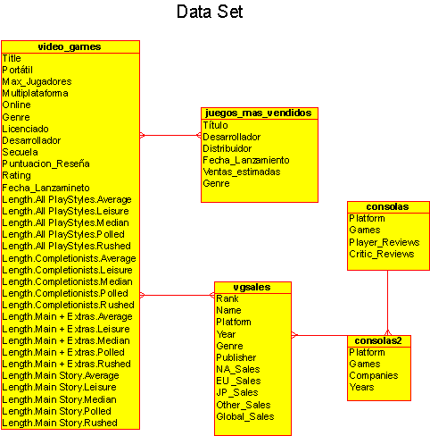

---

### 4.2 Carga de Datos

1. Instalación de módulos


```python
# Instalación de módulos
!pip install pandas
!pip install matplotlib
!pip install networkx
!pip install -U scikit-learn
!pip install sqlalchemy
```

2. Importar modulos

```python
# Importar modulos
import pandas as pd
import numpy as np
import matplotlib.pyplot as plt
from sklearn.model_selection import train_test_split
from sklearn.preprocessing import StandardScaler
from sklearn.linear_model import LinearRegression
from sklearn.linear_model import LogisticRegression
from sklearn.metrics import confusion_matrix
import seaborn as sns
from sklearn.metrics import accuracy_score
from sklearn.ensemble import RandomForestClassifier
from sklearn.preprocessing import OneHotEncoder
from sklearn.metrics import classification_report, confusion_matrix
from sklearn.compose import ColumnTransformer
```

3. Leer los archivos CSV

```python
# Importar modulos
# Leer los archivos CSV
df_juegos_top = pd.read_csv('data/juegos_mas_vendidos.csv', encoding='utf-8')
df_consolas = pd.read_csv('data/consolas.csv', encoding='utf-8')
df_consolas2 = pd.read_csv('data/consolas2.csv', encoding='utf-8')
df_vgsales = pd.read_csv('data/vgsales.csv', encoding='utf-8')
df_video_games = pd.read_csv('data/video_games.csv', encoding='utf-8')
```

### 4.3 Preprocesar los datos

#### 4.3.1 Fusionar data frames

Se van a fusionar dos DataFrames (df_consolas y df_consolas2), los atributos en común son "Platform" que representa el nombre de la Plataforma en que se ejecuta el Videojuego.

```python
# Fusiona los DataFrames de Consolas
df_consolas = pd.merge(df_consolas, df_consolas2, on='Platform', how='outer')
df_consolas.head()
```

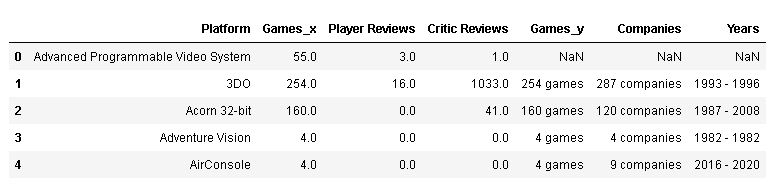


Se van a fusionar tres DataFrames (df_juegos, df_vgsales, df_video_games), los atributos en común son "Título" en df_juegos, "Name" en df_vgsales y "Title" en df_video_games que representa el nombre del videojuego.

```python
# Primero, cambiamos los nombres de las columnas para que sean iguales en todos los DataFrames
df_juegos_top.rename(columns={'Título': 'Title'}, inplace=True)
df_vgsales.rename(columns={'Name': 'Title'}, inplace=True)
# Se fusionas los DataFrames utilizando la columna 'Title' como atributo en comun
df_juegos = df_juegos_top.merge(df_vgsales, on='Title', how='outer')  # esto fusiona df_juegos_top y df_vgsales
df_juegos = df_juegos.merge(df_video_games, on='Title', how='outer')  # esto añade df_video_games al DataFrame fusionado

# Muestra el DataFrame resultante
df_juegos.head()
```
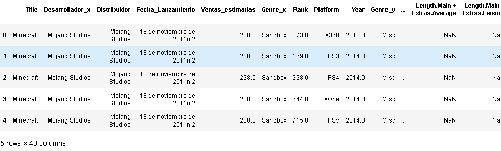

#### 4.3.2 Eliminar variables irrelevantes

El DataFrame df_consolas, se va eliminar el atributo 'Games_y' ya que se repite con el atributo 'Games_x', y se van a renombrar los atributos resultantes:
- 'Platform': 'Plataforma',
- 'Companies': 'Compañia',
- 'Games_x': 'Juegos_Desarrollados',
- 'Years': 'Anios',
- 'Player Reviews': 'Resenas_Jugador',
- 'Critic Reviews': 'Cantidad_Criticas'  

Se van a remplazar todos los valores nulos (NaN) en el DataFrame de acuerdo con el tipo de dato como lo son:
- 'Plataforma' con 'Desconocido'.
- 'Compañia' con 'Desconocido'.
- 'Juegos_Desarrollados con 0.
- 'Anios' con 0.
- 'Resenas_Jugador' con 0.
- 'Cantidad_Criticas' con 0.

```python
# Elimina las columnas originales 'Games_x' y 'Games_y'
df_consolas = df_consolas.drop(['Games_y'], axis=1)

# Extrae los números de las cadenas de texto en la columna 'Companies' y convierte estos números a enteros
df_consolas['Companies'] = df_consolas['Companies'].str.extract('(\d+)').astype(float)

# Reemplaza todos los valores nulos (NaN) en el DataFrame con 0
df_consolas = df_consolas.fillna(0)

df_consolas = df_consolas.rename(columns={
    'Platform': 'Plataforma',
    'Companies': 'Compañia',
    'Games_x': 'Juegos_Desarrollados',
    'Years': 'Anios',
    'Player Reviews': 'Resenas_Jugador',
    'Critic Reviews': 'Cantidad_Criticas'   
})

# Reacomodar los atributos según el orden deseado, puedes utilizar el método reindex()
df_consolas = df_consolas.reindex(columns=['Plataforma', 'Compañia', 'Juegos_Desarrollados', 'Anios', 'Resenas_Jugador', 'Cantidad_Criticas'])

df_consolas['Plataforma'].fillna('Sin información', inplace=True)
df_consolas['Compañia'].fillna('Sin información', inplace=True)
df_consolas['Juegos_Desarrollados'].fillna(0, inplace=True)
df_consolas['Anios'].fillna(0, inplace=True)
df_consolas['Resenas_Jugador'].fillna(0, inplace=True)
df_consolas['Cantidad_Criticas'].fillna(0, inplace=True)

df_consolas.head()
```
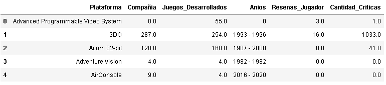

Del DataFrame df_juegos se realiza un procesado mas amplio de los datos:

- Se va reemplazar los valores nulos en la columna 'Genre_x' con los valores correspondientes de la columna 'Genre_y'.

- Se  va eliminar la columna 'Genre_y' del DataFrame, esto se hace porque ya se lleno los valores nulos en 'Genre_x' con los valores correspondientes.

- Se van a eliminar las columnas: 'Fecha_Lanzamiento', 'Unnamed: 11', 'Fecha_Lanzamineto', 'Desarrollador_y', 'Genre', 'Desarrollador_x' y 'Distribuidor'.

- Se van a renombrar las columnas del DataFrame y se proporciona un diccionario en el que se especifica el nuevo nombre de cada columna.

- Se reorganizan las columnas para una mejor comprensión.

- Se define una lista llamada 'columnas' que contiene los nombres de las columnas que se van a modificar, y se va iterar sobre cada columna en la lista para reemplazar los valores nulos que tengan.

- Para los atributos de tipo string se va remplazar los espacios vacios con por 'Desconocido'.
  
- Se define una lista llamada 'valores_incorrectos' ('2007', '2009', '2010', '2011', '2012', '2013', '2014', '2015'), que contiene los valores que se van a reemplazar en el atributo Genero por 'Desconocido'.

- Para los atributos de tipo int o float se va remplazar los espacios vacios con 0.
- Para los atributos de tipo bool se van a remplazar los espacios vacios con 'False'.

```python
# los datos en Genre_x y reemplazar los valores NaN con los valores correspondientes de Genre_y
df_juegos['Genre_x'] = df_juegos['Genre_x'].fillna(df_juegos['Genre_y'])
df_juegos = df_juegos.drop(columns='Genre_y')
df_juegos.head()
```

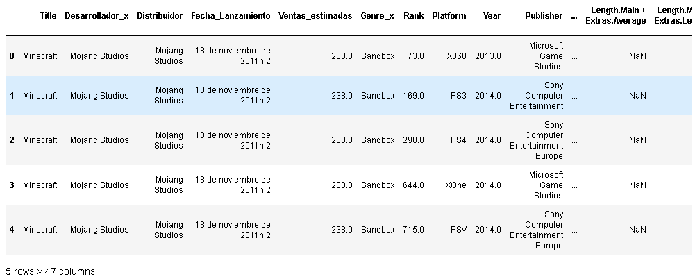

Se van a eliminar los atributos que no se utilizan en el analisis

```python
# Se van a eliminar los atributos que no se utilizan en el analisis
df_juegos = df_juegos.drop(['Fecha_Lanzamiento', 'Unnamed: 11', 'Fecha_Lanzamineto', 'Desarrollador_y','Genre', 'Desarrollador_x', 'Distribuidor' ], axis=1)
```

Se renombran los atributos resultantes

```python
# Se renombran los atributos resultantes
df_juegos = df_juegos.rename(columns={
    'Title': 'Titulo',
    'Genre_x': 'Genero',
    'Rank': 'Ranking',
    'Platform': 'Plataforma',
    'Year': 'Fecha_Lanzamiento',
    'Publisher': 'Compañia_Desarrollo',
    'NA_Sales': 'Ventas_NA',
    'EU_Sales': 'Ventas_EU',
    'JP_Sales': 'Ventas_JP',
    'Other_Sales': 'Ventas_Otros',
    'Global_Sales': 'Ventas_Globales'
})
```

Reacomodo de atributos para una mejor comprension

```python
# Reacomodo de atributos para una mejor comprension
df_juegos = df_juegos[[
    'Titulo', 
    'Compañia_Desarrollo', 
    'Fecha_Lanzamiento', 
    'Genero',    
    'Plataforma',
    'Multiplataforma',
    'Portátil', 
    'Online', 
    'Max_Jugadores',
    'Rating',
    'Ranking',
    'Puntuacion_Reseña',
    'Secuela',
    'Licenciado',
    'Ventas_NA',
    'Ventas_EU',
    'Ventas_JP',
    'Ventas_Otros',
    'Ventas_Globales',
    'Ventas_estimadas',
    'Length.All PlayStyles.Average',
    'Length.All PlayStyles.Leisure',
    'Length.All PlayStyles.Median',
    'Length.All PlayStyles.Polled',
    'Length.All PlayStyles.Rushed',
    'Length.Completionists.Average',
    'Length.Completionists.Leisure',
    'Length.Completionists.Median',
    'Length.Completionists.Polled',
    'Length.Completionists.Rushed',
    'Length.Main + Extras.Average',
    'Length.Main + Extras.Leisure',
    'Length.Main + Extras.Median',
    'Length.Main + Extras.Polled',
    'Length.Main + Extras.Rushed',
    'Length.Main Story.Average',
    'Length.Main Story.Leisure',
    'Length.Main Story.Median',
    'Length.Main Story.Polled',
    'Length.Main Story.Rushed'
]]
```

Se crea el atributo columnas con los atributos de tipo string y se van a remplazar los espacios vacios con 'Desconocido'

```python
# Se crea el atributo columnas con los atributos de tipo string
# Se van a remplazar los espacios vacios con 'Desconocido'
columnas = ['Titulo','Compañia_Desarrollo','Genero','Plataforma','Rating']

for columna in columnas:
    df_juegos[columna] = df_juegos[columna].fillna('Desconocido')
    df_juegos[columna] = df_juegos[columna].astype(str)
```

La columna 'Titulo' de df_juegos sólo contendrá el texto antes de los dos puntos para cada juego.

```python
# este código, la columna 'Titulo' de df_juegos sólo contendrá el texto antes de los dos puntos para cada juego.
df_juegos['Titulo'] = df_juegos['Titulo'].apply(lambda x: x.split(':')[0])
```

Reemplazar espacios en blanco con guiones bajos en la columna 'Titulo'

```python
# Reemplazar espacios en blanco con guiones bajos en la columna 'Titulo'
df_juegos['Titulo'] = df_juegos['Titulo'].str.replace(' ', '_')
```

Definir los valores a reemplazar en una lista por los valores en la columna 'Genero'

```python
# Definir los valores a reemplazar en una lista
valores_incorrectos = ['2007', '2009', '2010', '2011', '2012', '2013', '2014', '2015']
# Reemplazar los valores en la columna 'Genero'
df_juegos['Genero'] = df_juegos['Genero'].replace(valores_incorrectos, 'Desconocido')
```

 Se crea el atributo columnas con los atributos de tipo int o float y se van a remplazar los espacios vacios con '0'.

```python
# Se crea el atributo columnas con los atributos de tipo int o float
# Se van a remplazar los espacios vacios con '0'
columnas = ['Fecha_Lanzamiento','Max_Jugadores','Ranking','Puntuacion_Reseña','Ventas_NA','Ventas_EU',
          'Ventas_JP','Ventas_Otros','Ventas_Globales','Ventas_estimadas']

for columna in columnas:
    df_juegos[columna] = df_juegos[columna].fillna(0)
```

Se crea el atributo columnas con los atributos de tipo bool y se van a remplazar los espacios vacios con 'False'.

```python
# Se crea el atributo columnas con los atributos de tipo bool
# Se van a remplazar los espacios vacios con 'False'
columnas = ['Multiplataforma', 'Portátil', 'Online', 'Secuela', 'Licenciado']

for columna in columnas:
    df_juegos[columna] = df_juegos[columna].fillna(False)
```

Se crea el atributo columnas con los atributos de tipo float y se van a remplazar los espacios vacios con 'Desconocido'.

```python
# Se crea el atributo columnas con los atributos de tipo float
# Se van a remplazar los espacios vacios con 'Desconocido'
columnas = ['Length.All PlayStyles.Average','Length.All PlayStyles.Leisure','Length.All PlayStyles.Median',
            'Length.All PlayStyles.Polled','Length.All PlayStyles.Rushed','Length.Completionists.Average',
            'Length.Completionists.Leisure','Length.Completionists.Median','Length.Completionists.Polled',
            'Length.Completionists.Rushed','Length.Main + Extras.Average','Length.Main + Extras.Leisure',
            'Length.Main + Extras.Median','Length.Main + Extras.Polled','Length.Main + Extras.Rushed',
            'Length.Main Story.Average','Length.Main Story.Leisure','Length.Main Story.Median',
            'Length.Main Story.Polled','Length.Main Story.Rushed']

for columna in columnas:
    df_juegos[columna] = df_juegos[columna].fillna(0)
```
Se eliminan las columnas no necesarias

```python
# Lista de columnas a eliminar
columnas_a_eliminar = ['Length.All PlayStyles.Average','Length.All PlayStyles.Leisure','Length.All PlayStyles.Median','Length.All PlayStyles.Polled','Length.All PlayStyles.Rushed','Length.Completionists.Average','Length.Completionists.Leisure','Length.Completionists.Median','Length.Completionists.Polled','Length.Completionists.Rushed','Length.Main + Extras.Average','Length.Main + Extras.Leisure','Length.Main + Extras.Median','Length.Main + Extras.Polled','Length.Main + Extras.Rushed','Length.Main Story.Average','Length.Main Story.Leisure','Length.Main Story.Median','Length.Main Story.Polled','Length.Main Story.Rushed']

# Eliminar las columnas del DataFrame
df_juegos = df_juegos.drop(columnas_a_eliminar, axis=1)

df_juegos.head()
```

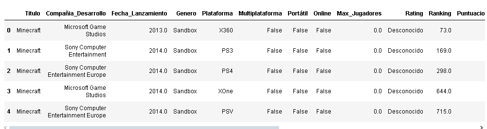

### 4.4 Definición de la(s) Variable(s) Objetivo(s).

**El objetivo es clasificar el 'Genero de juego' y la 'Plataforma'**, ya sea de forma separada o conjunta, para obtener la información de que tipo de Genero y Plataforma se puede desarrollar el Videojuego; por lo tanto, la correlación, clasificación y predicción del Género y Plataforma de Juego estará dada **por el análisis de Videojuegos Exitosos**.

La **variable objetivo** será determinar qué tipo de género de juego y plataforma serán útiles para la creación de un nuevo videojuego exitoso. En este contexto, **el éxito de un Videojuego** esta dado **por la cantidad de Copias Vendidas del Videojuego que está definido en el atributo 'Ventas Globales'**, por lo que las **Variables** a utilizar para alcanzar el **Objetivo** del proyecto pueden incluir:

- **Género del juego:** Esta variable representa la categoría o tipo de juego al que pertenece, como acción, aventura, estrategia, deportes, etc.

- **Plataforma:** Esta variable indica el sistema o dispositivo en el que el juego será lanzado y jugado, como PlayStation, Xbox, PC, Nintendo Switch, etc.

- **Ventas Globales:** Esta variable representa las ventas totales del juego en todo el mundo. Se va a **utilizar** como una **medida de éxito** para determinar **si un juego es exitoso o no**.

- Otras variables: También se pueden considerar otras variables relevantes para el análisis, como el rating del juego, las puntuaciones de reseñas, la compañía de desarrollo, la fecha de lanzamiento, etc., dependiendo de la disponibilidad de datos y la relevancia para el objetivo específico.

### 4.5 Almacenamiento de data frame en base de datos relacional
El proceso para el almacenamiento de datos en una base de datos relacional MySQL teniendo un data frame llamado df_juegos es crear una base de datos que defina las tablas, columnas, tipos de datos de las variables que se obtuvieron del proceso de Data Clean.

- Se genera una base de datos desde la terminal de comandos:

```SQL
CREATE DATABASE games;
```

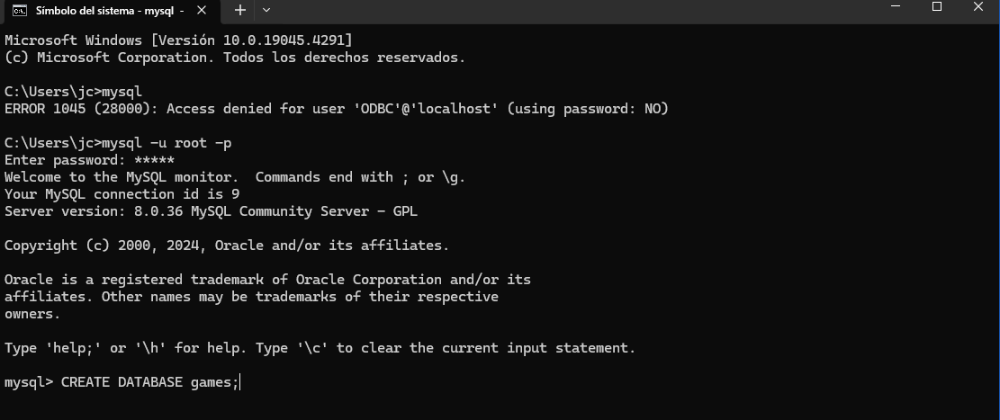

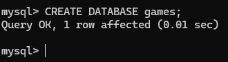

- Desde jupyter notebook se establece el código para convertir el data frame df_juegos en una tabla en la base de datos Games. Esto se hacer a través de una conexión con el servidor de base de datos y utilizando el módulo  sqlalchemy y pymysql.

```python
!pip install pymysql
```

- SQLAlchemy es una biblioteca que facilita la interacción con bases de datos relacionales y la función create_engine se utiliza para crear un objeto de motor SQLAlchemy, que permite comunicarse con la base de datos Games. 

```python
from sqlalchemy import create_engine
```

- Desde la aplicación de jupyter notebook se establece una conexión a la base de datos MySQL. Se proporciona los datos de acceso (nombre de usuario y contraseña) y la ubicación del servidor MySQL (host y puerto).

- Se declara una tabla llamada videojuegos donde se almacenará las variables de la data frame df_juegos.

```python
# Configurar la conexión a la base de datos MySQL
usuario = 'root'
contraseña = 'mysql'
host = 'localhost'
puerto = '3306'
base_de_datos = 'Games'
motor = create_engine(f'mysql+pymysql://{usuario}:{contraseña}@{host}:{puerto}/{base_de_datos}')

# Nombre de la tabla
nombre_de_tabla = 'videojuegos'  # Cambia el nombre de la tabla según sea necesario

# Crear una tabla en MySQL a partir del DataFrame df_juegos
df_juegos.to_sql(nombre_de_tabla, con=motor, index=False, if_exists='replace')

print(f"DataFrame df_juegos convertido a tabla '{nombre_de_tabla}' en MySQL exitosamente.")
```

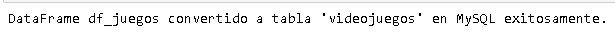

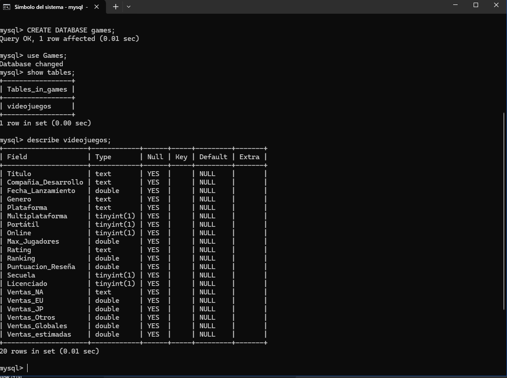

---

### 5. Modelado de Datos

Después de tener una limpieza de datos y organizadas las variables que se utilizaran para crear un ssitema de prediccion se puede comenzar a construir modelos de datos, como modelos de regresión, modelos de clasificación, clusters, etc.

Evaluación del modelo: Una vez que se tiene definido un modelo, se necesitas evaluar su rendimiento. Esto puede implicar técnicas como la validación cruzada, el uso de conjuntos de prueba y validación, y el cálculo de métricas de rendimiento.

Interpretación y comunicación de resultados: Finalmente, se interpreta los resultados del modelo y se genera la creación de visualizaciones, informes o presentaciones.


Source: https://nperci.org


La etapa de modelado utiliza la primera versión del conjunto de datos preparado y se enfoca en desarrollar modelos predictivos o descriptivos, a partir del uso de modelos estadísticos o matemáticos según el enfoque analítico previamente definido. La definición del modelo depende del objetivo con el que se vaya a realizar, mediante la definición del objetivo podemos establecer el modelo (descriptivo y/o predictivo).

#### 5.1 Tipos de Modelos

**Modelo Descriptivo**

El modelo descriptivo, se utiliza para describir o resumir un conjunto de datos o fenómenos observados. Su objetivo principal es comprender y comunicar las características, patrones o relaciones presentes en los datos y proporcionar información descriptiva sobre los datos. Se pueden platear preguntas como "¿qué está sucediendo?", "¿cuáles son las características principales de los datos?" o "¿cómo se relacionan las variables entre sí?". 

**Modelo Predictivo**

El modelo predictivo, se utiliza en un conjunto de capacitación (datos históricos en los que se conoce el resultado de interés) para construir el modelo, ya que su objetivo es predecir la probabilidad de éxito de un variable en función de variables específicas y hacer predicciones sobre eventos futuros. Este modelo busca responder preguntas como "¿qué sucederá en el futuro?", "¿cuál será el resultado de cierto evento?" o "¿cuál es la probabilidad de que ocurra un determinado resultado?".

Independientemente del modelo que se va utilizar, se debe hacer uso de herramientas o técnicas que ayuden a entender el tipo de modelo y el objetivo del análisis; en el modelo descriptivos se pueden utilizar técnicas como medidas de tendencia central (como la media o la mediana), medidas de dispersión (como la desviación estándar o el rango Inter cuartil) y en el modelo predictivo, se van a utilizar **_Algoritmos_ (regresión, clasificación o series de tiempo)**  que revisan los datos y que son capaces de predecir comportamientos futuros.

El proceso de modelado normalmente es muy iterativo, ya que las organizaciones están adquiriendo insights intermedios, lo que deriva en ajustes en la preparación de datos y en la especificación del modelo. Para una técnica determinada, se pueden probar múltiples algoritmos con sus respectivos parámetros para encontrar el mejor modelo para las variables disponibles. Cada método tiene ciertos puntos fuertes y es más adecuado para determinados tipos de problemas.

Para ambos tipos de modelos se va a necesitar gráficos y visualizaciones de datos, AED, técnicas de agrupamiento o clustering, análisis de componentes principales (PCA) y análisis de correlación, que van a buscar utilizar estos datos para hacer proyecciones, descripciones y/o toma de decisiones basadas en las predicciones.


Source:  http://bigdatauniversity.com/bdu-wp/bdu-course/data-science-methodology


#### 5.2 Métodos de Modelado

Los diferentes _Tipos de Modelo (descriptivo o predictivo)_ a implementar en áreas de la Inteligencia Artificial, tales como el Machine Learning, Ciencia de Datos o Big Data, permiten derivar nueva información procedente de los datos y desarrollar **Modelos predictivos**.

Para iniciar a Modelar datos en el Modelo Predictivo, existen algunos métodos de modelado que se dividen en estas categorías:

- No Supervisado.
  - Asociación.
  - Segmentación.
  
  
- Supervisado.


    
#### 5.3 Modelo No Supervisado

El **_Modelo No Supervisado_**, es un tipo de modelo de aprendizaje automático en el que no se proporciona una variable objetivo previamente. En cambio, el modelo busca patrones y estructuras inherentes en los datos sin etiquetas. El objetivo principal de un modelo no supervisado es encontrar agrupaciones, similitudes o relaciones ocultas en los datos. Este tipo de modelo exploran los datos sin ninguna guía específica y pueden revelar información valiosa sobre las características y estructuras subyacentes de los datos. Los modelos no supervisados se utilizan en diversos casos, como la segmentación de clientes, la detección de anomalías, la reducción de dimensionalidad y la recomendación de productos. Existen tipos de modelos No Supervisado como el **_Modelos de asociación y Modelos de segmentación_**.

**Modelos de asociación**

Los modelos de asociación encuentran patrones en los datos en los que una o más entidades (como eventos, compras o atributos) se asocian con una o más entidades. Los modelos construyen conjuntos de reglas que definen estas relaciones. Aquí los campos de los datos pueden funcionar como entradas y destinos. Podría encontrar estas asociaciones manualmente, pero los algoritmos de reglas de asociaciones lo hacen mucho más rápido, y pueden explorar patrones más complejos. Los modelos Apriori y Carma son ejemplos del uso de estos algoritmos. Otro tipo de modelo de asociación es el modelo de detección de secuencias, que encuentra patrones secuenciales en datos estructurados temporalmente.

Los modelos de asociación son los más útiles si se desean predecir varios resultados; por ejemplo, los clientes que adquirieron el producto X también adquirieron Y y Z. Los modelos de asociación relacionan una conclusión específica (como la decisión de adquirir un producto) con un conjunto de condiciones. La ventaja de los algoritmos de reglas de asociación sobre los algoritmos más estándar de árboles de decisión (C5.0 y Árbol C&R) es que las asociaciones pueden existir entre cualquiera de los atributos. Un algoritmo de árbol de decisión generará reglas con una única conclusión, mientras que los algoritmos de asociación tratan de buscar muchas reglas, cada una de las cuales puede tener una conclusión diferente.

**Modelos de segmentación**

Los modelos de segmentación dividen los datos en segmentos o clústeres de registros que tienen patrones similares de campos de entrada. Como sólo se interesan por los campos de entrada, los modelos de segmentación no contemplan el concepto de campos de salida o destino. 

Los modelos de segmentación (también conocidos como "modelos de agrupación en clústeres") son útiles en aquellos casos en los que se desconoce el resultado específico (por ejemplo, a la hora de detectar nuevos patrones de fraude o de identificar grupos de interés en la base de clientes). Los modelos de agrupación en clústeres se centran en la identificación de grupos de registros similares y en el etiquetado de registros según el grupo al que pertenecen. Esto se lleva a cabo sin la ventaja que ofrece el conocimiento previo sobre los grupos y sus características, y diferencia a los modelos de clústeres de otras técnicas de modelado en que no hay campos de salida u objetivo predefinidos para el modelo que se va a predecir. No hay respuestas correctas o incorrectas para estos modelos. Su valor viene determinado por su capacidad de capturar agrupaciones interesantes en los datos y proporcionar descripciones útiles de dichas agrupaciones. Los modelos de clúster se usan a menudo para crear clústeres o segmentos que se usan posteriormente como entradas en análisis posteriores, (por ejemplo, mediante la segmentación de clientes potenciales en subgrupos homogéneos).

#### 5.4 Modelo Supervisado

Los Modelos supervisados utilizan los valores de uno o varios campos de entrada para predecir el valor de uno o varios resultados o campos de destino, algunos ejemplos de estas técnicas son: 

- Arboles de decisiones.
- **_Algoritmos de regresión._**
  - Lineal.
  - Logística.
  - Lineal generalizada.
  - Random forest.
- Redes neuronales.
- Máquinas de vectores de soporte.
- Redes bayesianas.


Los modelos supervisados ayudan a las organizaciones a predecir un resultado conocido, por ejemplo, si un cliente comprará o se irá o si una transacción se ajusta a un patrón conocido de fraude. Las técnicas de modelado incluyen aprendizaje automático de las máquinas, inducción de reglas, identificación de subgrupos, métodos estadísticos y generación de varios modelos.

Ejemplos de casos de uso:

- Categorización de siniestros. Podría categorizar las zonas más siniestradas de una ciudad entrenando un modelo con la historia de datos. De esta manera se podría generar mejores rutas de patrullaje por los policías.

- Predecir el éxito. Para hoteles u hospedajes de AIRBNB podría predecir si van a tener éxito o no considerando las variables que comunican en sus anuncios.

**Algoritmos de Regresión**

Es útil para predecir productos continuos. La respuesta se presenta como cantidad. El valor predicho puede usarse para identificar la relación lineal entre atributos.

Ejemplos:

- Precios de vivienda. Estimar precios de inmuebles considerando variables como dimensión de propiedad, tamaño de construcción, pisos, recámaras y otras características.
- Predecir camas hospitalarias necesarias. Una oficina o secretaría de salud podría predecir con base a su histórico la cantidad de camas y doctores que serán necesarios el próximo año para atender a la demanda de la población. Un avance que pudiéramos llevar allá es con la cantidad de mujeres embarazadas.
- Identificar las cervezas que necesitarás en tu inventario. Predecir la cantidad de inventarios es una de las aplicaciones más usadas en el sector retail.

**Técnicas**

**Regresión lineal:**
La regresión lineal es un método de modelado estadístico que se utiliza para predecir o estimar el valor de una variable dependiente continua en función de una o más variables independientes. El objetivo es encontrar la mejor línea recta que se ajuste a los datos y minimice la diferencia entre los valores observados y los valores predichos. Se asume una relación lineal entre las variables y se utilizan técnicas como el método de los mínimos cuadrados para calcular los coeficientes de la línea recta. La regresión lineal es ampliamente utilizada en diversos campos para realizar predicciones y analizar relaciones entre variables.

**Regresión no lineal:**
La regresión no lineal es similar a la regresión lineal, pero permite modelar relaciones no lineales entre las variables dependientes e independientes. En lugar de ajustarse a una línea recta, los modelos de regresión no lineal se ajustan a curvas más complejas, como polinomios, exponenciales, logaritmos, entre otros. Estos modelos pueden capturar relaciones más flexibles y pueden ser más adecuados cuando los datos muestran patrones no lineales. La regresión no lineal se utiliza en diversas áreas, como ciencias de la salud, economía, física, entre otras, para modelar y predecir fenómenos más complejos.

**Regresión Logística:**
La regresión logística es un algoritmo de aprendizaje supervisado que se utiliza para predecir la probabilidad de pertenencia a una clase específica en función de variables predictoras. En este caso, el modelo se entrena con datos de juegos existentes (género y plataforma) y su éxito o no éxito en términos de ventas globales. Luego, se utiliza para predecir si una nueva idea de juego será exitosa o no, en función de su género y plataforma.

**Máquinas de soporte de vectores (support vector machines):**
Las máquinas de vectores de soporte son un algoritmo de aprendizaje supervisado utilizado tanto para clasificación como para regresión. El objetivo principal de las SVM es encontrar el hiperplano óptimo que maximiza el margen entre las clases en un espacio dimensional más alto. Utiliza puntos de datos de entrenamiento llamados vectores de soporte para definir el hiperplano y clasificar nuevas instancias en una de las dos clases. Las SVM son conocidas por su capacidad para manejar conjuntos de datos complejos y de alta dimensión, y han demostrado ser efectivas en aplicaciones como reconocimiento de imágenes, clasificación de texto y detección de anomalías.

**Redes Neuronales Artificiales:**
Las redes neuronales son modelos de aprendizaje automático inspirados en el funcionamiento del cerebro humano. Están compuestas por múltiples capas de neuronas artificiales interconectadas, donde cada neurona realiza cálculos y transmite señales a través de conexiones ponderadas. Estas redes pueden aprender y adaptarse a partir de datos para realizar tareas de clasificación, regresión o reconocimiento de patrones. Cada capa de neuronas procesa y extrae características de los datos de entrada, lo que permite un aprendizaje profundo y la detección de relaciones complejas. Las redes neuronales se utilizan en una amplia gama de aplicaciones, como reconocimiento de imágenes, procesamiento del lenguaje natural, análisis de datos y más.

**Aprendizaje profundo (deep learning):**
El aprendizaje profundo es una rama del aprendizaje automático que se basa en redes neuronales profundas. Utiliza algoritmos de aprendizaje automático para entrenar redes neuronales con múltiples capas ocultas, lo que permite un aprendizaje jerárquico de características complejas en los datos. El aprendizaje profundo se caracteriza por su capacidad para extraer y aprender representaciones de alto nivel de los datos de entrada, lo que puede conducir a un rendimiento mejorado en tareas de reconocimiento, clasificación, generación de contenido y toma de decisiones. Es especialmente efectivo cuando se trabaja con grandes conjuntos de datos y problemas complejos. El aprendizaje profundo ha impulsado avances significativos en áreas como el procesamiento de imágenes y el procesamiento del lenguaje natural.

**Bosques aleatorios (random forests):**
Los bosques aleatorios son un conjunto de árboles de decisión que trabajan juntos para realizar clasificación o regresión. Cada árbol se entrena en una muestra aleatoria de datos y realiza una votación para determinar la clasificación final o el valor de regresión. Los bosques aleatorios tienen la capacidad de manejar grandes conjuntos de datos con alta dimensionalidad.


Source: https://www.ibm.com/docs/es/spss-modeler/saas?topic=mining-types-models

---
#### 5.5 Proceso Modelado de Datos

El modelado de datos se refiere al proceso de construcción de algoritmos (Machine Learning, Data Scinece, Big Data, entre otros), que pueden realizar predicciones o estimaciones sobre resultados futuros. En el contexto del Objetivo del proyecto, el modelado de datos que se va a desarrollar es para predecir el éxito o aceptación de un determinado género de juego en una plataforma específica.

Para aplicar el modelado de datos predictivo a esta hipótesis, se realizan los siguientes pasos:

- Recopilación de datos: Obtener un conjunto de datos históricos que contenga información relevante sobre juegos similares al videojuego que se desea desarrollar. Estos datos deben incluir características del juego, como género, plataforma, ventas, reseñas, etc.
- Preparación de datos: Limpiar y preprocesar los datos, eliminando valores atípicos, datos faltantes y realizando transformaciones necesarias.
- Selección de variables: Identificar las variables o características del juego que pueden influir en su éxito o aceptación. Esto puede incluir el género, plataforma, características específicas del juego, datos demográficos de los jugadores, etc.
- Construcción del modelo: Seleccionar el algoritmo de aprendizaje automático adecuado para el tipo de problema y datos disponibles. Algunos ejemplos podrían ser regresión logística, árboles de decisión, bosques aleatorios o redes neuronales.
- Entrenamiento del modelo: Utilizar los datos históricos para entrenar el modelo, ajustando los parámetros del algoritmo y optimizando su rendimiento.
- Validación del modelo: Evaluar el rendimiento del modelo utilizando técnicas como la validación cruzada o la división de datos en conjuntos de entrenamiento y prueba. Medir métricas de rendimiento como precisión, recall, puntaje F1, etc.
- Predicción y toma de decisiones: Utilizar el modelo entrenado para realizar predicciones sobre el éxito o aceptación de un determinado género de juego en una plataforma específica. Estas predicciones pueden ayudar en la toma de decisiones sobre el tipo de género y plataforma a desarrollar para el videojuego.

##### 1 Recopilación de datos

Son los datos recopilados en formato csv y teniendo el data frame df_juegos y que se almaceno en una base de datos relacional en mysql llamada Games.

##### 2 Preparación de datos

Se tiene el Data Frames resultantes df_juegos ya que se concluyó que se va a utilizar por contener la información más cercana al objetivo del proyecto.

##### 3 Selección de variables

Las variables para utilizar y crear el modelo son:
- 'Género'.
- 'Plataforma'.
- 'Ventas_Globales'.

Y su correlación positiva con:
- 'Ranking'.
- 'Puntuacion_Reseña'.

##### 4 Construcción del modelo

En base al análisis de los resultados del DataClean, se tomó la decisión de crear varios "Modelos de Datos", por la razón de tener un porcentaje mayor de éxito al Objetivo del proyecto. Los modelos por crear son Modelos Supervisados, porque van a utilizar un conjunto de datos etiquetados, donde se conocen las 'Ventas_Globales' de los videojuegos (variable objetivo).

Los modelos por implementar:

- Modelo de Clasificación: para predecir la categoría género de un videojuego con las variables de entrada que va a usar el algoritmo de clasificación Random Forest.

- Regresión lineal, que se va a usar para entrenar el modelo y ajustar los coeficientes de la regresión. La selección de este algoritmo es porque puede encontrar la mejor línea recta que se ajuste a los datos para predecir la variable objetivo. El modelo de regresión lineal va a predecir las ventas globales de videojuegos en función de las variables utilizadas ('Género', 'Plataforma' y 'Compañía de desarrollo'). Estas variables tienen características para predecir las ventas globales de los videojuegos y encontrar posibles relaciones o patrones entre ellas y las ventas globales.

---

###### 5.6 Modelo de Clasificación

El modelo se define en los siguientes pasos:

- Predecir la categoría 'Genero'.
- Implementar el algoritmo Random Forest: es un algoritmo potente y versátil que puede manejar tanto variables categóricas como numéricas.
- El algoritmo va a encontrar una frontera de decisión que separe las diferentes clases en el espacio de las variables de entrada.
- Las variables de entrada son 'Plataforma', 'Ranking', 'Puntuacion_Reseña' y 'Ventas_Globales'.
- La variable 'Plataforma' es categórica, por lo que se va a codificar usando el proceso llamado codificación one-hot. 
- Dividir los datos en conjuntos de entrenamiento y prueba.
- Predecir las etiquetas para los datos de prueba.
- Calcular la precisión del modelo.
- Mostrar el informe de clasificación.


```python
# Variables de entrada y de salida
X = df_juegos[['Plataforma', 'Ranking', 'Puntuacion_Reseña', 'Ventas_Globales']]
y = df_juegos['Genero']

# Codificación one-hot para la variable categórica 'Plataforma'
column_transformer = ColumnTransformer(
    [('Plataforma_category', OneHotEncoder(dtype='int'),['Plataforma'])],
    remainder='passthrough'
)

X = column_transformer.fit_transform(X)

# Dividir los datos en conjuntos de entrenamiento y prueba
X_train, X_test, y_train, y_test = train_test_split(X, y, test_size=0.2, random_state=42)

# Crear y entrenar el modelo
model = RandomForestClassifier(n_estimators=100, random_state=42)
model.fit(X_train, y_train)

# Predecir las etiquetas para los datos de prueba
y_pred = model.predict(X_test)

# Calcular la precisión del modelo
print("Accuracy:", accuracy_score(y_test, y_pred))

# Mostrar la matriz de confusión
print("Confusion Matrix:")
print(confusion_matrix(y_test, y_pred))

# Mostrar el informe de clasificación
print("Classification Report:")
print(classification_report(y_test, y_pred))
```

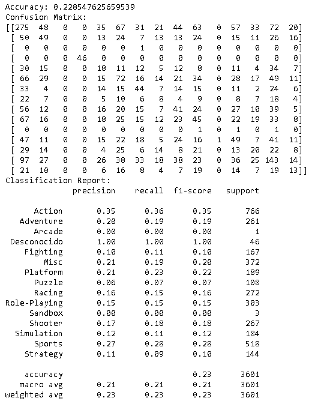


```python
# Clases para el gráfico
generos = ['Action', 'Adventure', 'Arcade', 'Desconocido', 'Fighting', 'Misc', 'Platform', 
               'Puzzle', 'Racing', 'Role-Playing', 'Sandbox', 'Shooter', 'Simulation', 'Sports', 'Strategy']

# Calculamos la matriz de confusion
cm = confusion_matrix(y_test, y_pred)

# Convertimos la matriz de confusion en un dataframe de pandas
cm_df = pd.DataFrame(cm, index=generos, columns=generos)

# Creamos el gráfico con Seaborn
plt.figure(figsize=(10, 8))
sns.heatmap(cm_df, annot=True, cmap='YlGnBu', fmt='g')
plt.title('Matriz de Confusión para el Clasificador de Géneros de Videojuegos \nPrecisión:{0:.3f}'.format(accuracy_score(y_test, y_pred)))
plt.ylabel('Valor verdadero')
plt.xlabel('Valor predicho')
plt.show()
```

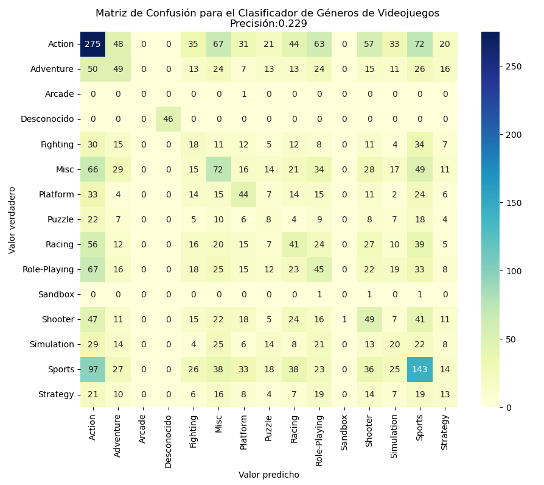

---

###### 5.6.1 Resultados del Modelo de Clasificación

Los resultados en base al informe de clasificación:


- La precisión del modelo (Accuracy) es aproximadamente 0.23 o 23%, lo que significa que el modelo predice correctamente el género del videojuego en un 23% de los casos en el conjunto de pruebas. En términos generales, esto no es muy bueno.

- La matriz de confusión muestra cuántas veces se predijo correcta o incorrectamente cada clase. Por ejemplo, la primera fila corresponde a la clase "Action". De 766 juegos de acción reales, el modelo predijo correctamente 275 de ellos. Sin embargo, también predijo incorrectamente 48 como "Adventure", 35 como "Fighting", 67 como "Misc", etc.


El informe de clasificación proporciona más detalles sobre el rendimiento del modelo para cada clase de acuerdo con las métricas:


- Precisión (Precisión): Es la proporción de predicciones positivas que fueron correctas, cuando el modelo predice "Action", es correcto el 35% de las veces.


- Recall: Es la proporción de casos positivos reales que fueron detectados correctamente, el modelo detecta 36% de los juegos de acción reales.


- F1-score: Es una métrica que combina precisión y recall en una sola cifra. Es útil cuando se quiere comparar dos o más modelos, especialmente si no tienes una preferencia específica entre precisión y recall.

- Soporte (Support): Es el número de ocurrencias de cada clase en el conjunto de pruebas.


Estos resultados sugieren que el modelo tiene problemas para predecir el género de los videojuegos basándose en las variables de entrada que se han utilizado. Puede ser útil explorar otras variables, crear nuevas características, usar otro algoritmo de clasificación o ajustar los parámetros del modelo actual para tratar de mejorar el rendimiento.

---

## 5.7 Modelo de Regresión

El modelo se define en los siguientes pasos:

- Predecir la característica 'Ventas_Globales’.
- Implementar el algoritmo regresión lineal: es un enfoque estadístico para modelar la relación entre una variable dependiente (o variable objetivo) y una o más variables independientes (o características).
- El algoritmo va a predecir las 'Ventas_Globales' basándose en las características 'Genero', 'Plataforma' y 'Compañia_Desarrollo'.
- Las variables de entrada son 'Genero', 'Plataforma' y 'Compañia_Desarrollo'.
- Definir de las características y el objetivo: 'Genero', 'Plataforma' y 'Compañia_Desarrollo' son características, y 'Ventas_Globales' es el objetivo.
- Convertir las características categóricas a numéricas, se va a utilizar variables ficticias (o dummies) para convertir estas características categóricas en numéricas.
- Dividir los datos en conjuntos de entrenamiento y prueba.
- Crear y entrenar el modelo de regresión lineal.
- Predecir las ventas globales para el conjunto de prueba
- Resultados del modelo de predicción.


---


```python
# Define las características (X) y el objetivo (y):
# Definir las características (X) y el objetivo (y)
X = df_juegos[['Genero', 'Plataforma', 'Compañia_Desarrollo']]  # Aquí puedes agregar más características si lo deseas
Y = df_juegos['Ventas_Globales']

# Convertir las características categóricas a numéricas
X = pd.get_dummies(X)

# Dividir los datos en conjuntos de entrenamiento y de prueba
X_train, X_test, Y_train, Y_test = train_test_split(X, Y, test_size=0.2, random_state=42)

# Crear y entrenar el modelo de regresión
model = LinearRegression()
model.fit(X_train, Y_train)

# Predecir las ventas para el conjunto de prueba
Y_pred = model.predict(X_test)
```

## 5.7.1 Entrenamiento del modelo

El modelo se entrena utilizando las características 'Genero', 'Plataforma' y 'Compañia_Desarrollo' para predecir las ventas globales de los videojuegos. Las características categóricas se convierten en variables numéricas antes de entrenar el modelo.

El proceso de entrenamiento del modelo:

- Se define el conjunto de características (X) y el objetivo (y) que se utilizarán para entrenar el modelo. Las características (X) se obtienen del DataFrame df_juegos y se seleccionan las columnas 'Genero', 'Plataforma' y 'Compañia_Desarrollo'.

- El objetivo (y) se obtiene del DataFrame df_juegos y se selecciona la columna 'Ventas_Globales'. Las características categóricas en X se convierten en variables numéricas utilizando la técnica de codificación one-hot mediante pd.get_dummies(X).

- Los datos se dividen en conjuntos de entrenamiento (X_train, y_train) y de prueba (X_test, y_test) utilizando la función train_test_split(). Se utiliza un tamaño de prueba del 20% y se establece una semilla aleatoria para garantizar la reproducibilidad de los resultados.

- Se crea un objeto de modelo de regresión lineal utilizando LinearRegression(). El modelo se entrena utilizando los datos de entrenamiento (X_train, y_train) mediante el método fit().

Variables utilizadas:

- X: El conjunto de características utilizado para entrenar el modelo. Incluye las columnas 'Genero', 'Plataforma' y 'Compañia_Desarrollo' del DataFrame df_juegos.
- y: El objetivo del modelo, que corresponde a las ventas globales de los videojuegos (columna 'Ventas_Globales' en df_juegos).


```python
# Supongamos que tenemos un nuevo juego con los siguientes atributos:
nuevo_juego = pd.DataFrame({
    'Genero': ['Action'],  # Insertar el género del nuevo juego aquí
    'Plataforma': ['PC'],  # Insertar la plataforma del nuevo juego aquí
    'Compañia_Desarrollo': ['Capcom'],  # Insertar la compañía de desarrollo del nuevo juego aquí
})

# Convertir las características categóricas a numéricas
nuevo_juego = pd.get_dummies(nuevo_juego).reindex(columns = X_train.columns, fill_value=0)

# Usar el modelo para predecir las ventas del nuevo juego
ventas_predichas = model.predict(nuevo_juego)

ventas_predichas = ventas_predichas[0]

print('Las ventas globales predichas para el nuevo juego son:', ventas_predichas, ' de copias')
```

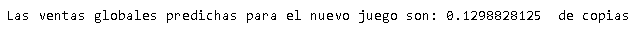

## 5.7.2 Validación del modelo

El proceso de validación del modelo:

- Se crea un nuevo DataFrame llamado ‘nuevo_juego’ que representa un nuevo juego con atributos para los cuales deseamos predecir las ventas globales.
- Los atributos categóricos del nuevo juego ('Genero', 'Plataforma', 'Compañia_Desarrollo') se convierten en variables numéricas utilizando la técnica de codificación one-hot mediante pd.get_dummies(nuevo_juego).
- El DataFrame nuevo_juego se reindexa para asegurarse de que todas las columnas sean las mismas que las utilizadas durante el entrenamiento del modelo. Esto se logra mediante reindex(columns=X_train.columns, fill_value=0), donde X_train es el conjunto de características utilizado para entrenar el modelo.
- Se utiliza el modelo entrenado (model) para predecir las ventas globales del nuevo juego utilizando el método predict(nuevo_juego).
- El valor de las ventas globales predichas se almacena en la variable ventas_predichas.
- Se imprime en pantalla el mensaje "Las ventas globales predichas para el nuevo juego son:" seguido del valor de ventas_predichas[0], que representa la predicción de ventas para el nuevo juego.

La validación del modelo se realiza de tal forma que se va a asignar nuevos valores a los atributos específicos y predecir de ventas del nuevo juego. Esto puede permitir obtener una estimación de las ventas globales del nuevo juego basada en el modelo entrenado.

---

## 5.7.3 Resultados del Modelo de Regresión

La predicción del modelo utilizando regresión lineal a partir de los atributos 'Genero', 'Plataforma' y    'Compañia_Desarrollo' da como resultado: 

**Las ventas globales predichas para el nuevo juego son: 0.1502685546875 de copias**

El modelo entrenado puede realizar predicciones sobre el éxito de un determinado género de juego en una plataforma específica. Estas predicciones pueden ayudar en la toma de decisiones sobre el tipo de género y plataforma a desarrollar el Videojuego.

---

## 5.8 Modelo de Regresión Logística

El modelo se define en los siguientes pasos:

- Predecir la probabilidad que un videojuego sea exitoso o no.
- Implementar el algoritmo de Regresión Logística: es un algoritmo que ajusta los coeficientes de la regresión para encontrar la mejor línea de separación entre las clases.
- El algoritmo va a predecir la probabilidad de clasificar correctamente los videojuegos como exitosos o no exitosos, va utilizar las variables 'Género', 'Plataforma' y 'Compañía de desarrollo'.
- Las variables las variables predictoras 'Género', 'Plataforma' y 'Compañía de desarrollo'.
- Definir las características 'Genero', 'Plataforma' y el objetivo 'Exitoso'.
- Ajustar los coeficientes de la regresión logística para maximizar la probabilidad de clasificar correctamente los videojuegos como exitosos o no exitosos.
- Calcular la media de las ventas globales y se utiliza como umbral para determinar qué juegos se considerarán exitosos.
- Crear una nueva columna llamada 'Exitoso' que indica si las ventas globales superan el umbral.
- Realizar la codificación one-hot de las columnas categóricas 'Genero' y 'Plataforma' utilizando el encoder OneHotEncoder de scikit-learn.
- Dividir los datos en conjuntos de entrenamiento y prueba.
- Crear el clasificador de regresión logística utilizando LogisticRegression.
- Entrenar el modelo utilizando los datos de entrenamiento.
- Predecir si un videojuego sea exitoso o no.
- Evaluar el rendimiento del modelo en la clasificación de los juegos como exitosos o no exitosos.


---

```python
df_juegos['Ventas_Globales'] = df_juegos['Ventas_Globales'] * 1000000
media_ventas_globales = df_juegos['Ventas_Globales'].mean()
print(f"Media de Ventas Globales: {media_ventas_globales}")

umbral = media_ventas_globales

df_juegos['Exitoso'] = df_juegos['Ventas_Globales'] > umbral

# Asignar las variables predictoras (X) y la variable objetivo (y)
X = df_juegos[['Genero', 'Plataforma']]
Y = df_juegos['Exitoso']

# Codificación One-Hot de las columnas categóricas
encoder = OneHotEncoder()
encoded_df = pd.DataFrame(encoder.fit_transform(X).toarray())

# Obtener las categorías de las columnas categóricas
categories = encoder.categories_

# Crear una lista con los nombres de las nuevas columnas
new_columns = [f'{col}_{val}' for col, vals in zip(['Genero', 'Plataforma'], categories) for val in vals]

# Asignar los nuevos nombres a las columnas del DataFrame
encoded_df.columns = [new_columns]

# Dividir los datos en conjuntos de entrenamiento y prueba
X_train, X_test, Y_train, Y_test = train_test_split(encoded_df, Y, test_size=0.2, random_state=42)

# Crear el clasificador de regresión logística
classifier = LogisticRegression()

# Entrenar el modelo
classifier.fit(X_train, Y_train)

# Realizar predicciones en los datos de prueba
Y_pred = classifier.predict(X_test)

# Evaluar el modelo
print(classification_report(Y_test, Y_pred))
print(confusion_matrix(Y_test, Y_pred))
```

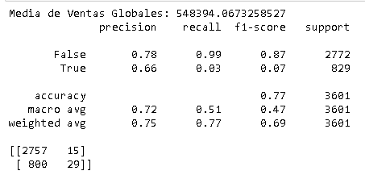

## 5.8.1 Entrenamiento del modelo

- Se realiza un preprocesamiento de los datos. Se multiplica la columna 'Ventas_Globales' por 1,000,000 para obtener las ventas globales en unidades más manejables. 

- Se calcula la media de las ventas globales y se utiliza como umbral para determinar qué juegos se considerarán exitosos.

- Se crea una nueva columna llamada 'Exitoso' que indica si las ventas globales superan el umbral.

- Se asignan las variables predictoras (X) y la variable objetivo (Y) a partir del DataFrame 'df_juegos'. Las variables predictoras son 'Genero' y 'Plataforma', y la variable objetivo es 'Exitoso'.

- Se realiza la codificación one-hot de las columnas categóricas 'Genero' y 'Plataforma' utilizando el encoder OneHotEncoder de scikit-learn. Esto es necesario para convertir las variables categóricas en variables numéricas que el modelo pueda entender.

- Se dividen los datos en conjuntos de entrenamiento y prueba utilizando la función train_test_split. En este caso, se asigna el 20% de los datos al conjunto de prueba y el 80% restante al conjunto de entrenamiento.

- Se crea el clasificador de regresión logística utilizando LogisticRegression de scikit-learn y se entrena el modelo utilizando los datos de entrenamiento (X_train, Y_train).

- Al tener entrenado el modelo, se realizan predicciones en los datos de prueba utilizando el método predict del clasificador. Las predicciones se almacenan en la variable 'Y_pred'.

- Se evalúa el modelo utilizando la función classification_report y confusion_matrix para obtener métricas de evaluación como la precisión, el recall, el F1-score y la matriz de confusión. Estas métricas permiten evaluar el rendimiento del modelo en la clasificación de los juegos como exitosos o no exitosos.

---

### 5.8.2 Validación del modelo

La validación del modelo se realiza utilizando técnicas de división de los datos en conjuntos de entrenamiento y prueba, y posteriormente evaluando el rendimiento del modelo en el conjunto de prueba.

En este caso, se ha utilizado el método train_test_split de la biblioteca scikit-learn para dividir los datos en un conjunto de entrenamiento (X_train, Y_train) y un conjunto de prueba (X_test, Y_test). El parámetro test_size=0.2 indica que se ha asignado el 20% de los datos al conjunto de prueba, mientras que el 80% restante se ha utilizado para el entrenamiento.

Después de dividir los datos, se ha creado un clasificador de regresión logística utilizando LogisticRegression de scikit-learn. Este clasificador se ha entrenado utilizando los datos de entrenamiento (X_train, Y_train).

Una vez entrenado el modelo, se han realizado predicciones en los datos de prueba utilizando el método predict del clasificador. Estas predicciones se han almacenado en la variable Y_pred.

Finalmente, se ha evaluado el modelo utilizando las métricas de evaluación classification_report y confusion_matrix. El classification_report proporciona información detallada sobre la precisión, el recall y el F1-score para cada clase, así como el soporte (número de instancias) de cada clase en el conjunto de prueba. La confusion_matrix muestra la matriz de confusión, que proporciona información sobre las predicciones correctas e incorrectas del modelo.


---


```python
# Obtener la matriz de confusión
cm = confusion_matrix(Y_test, Y_pred)

# Crear una figura
plt.figure(figsize=(6, 6))

# Crear el mapa de calor de la matriz de confusión
sns.heatmap(cm, annot=True, fmt='d', cmap='Blues', cbar=False)

# Configurar los nombres de los ejes
plt.xlabel('Prediccion')
plt.ylabel('Actual')

# Configurar el título
plt.title('Matriz de Confusion')

# Mostrar la figura
plt.show()
```

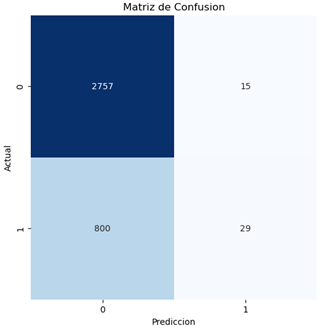

## 5.8.3 Resultados del Modelo de Regresión Logística

Los resultados en base al informe de clasificación:


- Precisión: La precisión es la proporción de predicciones positivas que fueron realmente correctas. En tu caso, la precisión para la clase "False" (no exitoso) es del 87%, lo que significa que el 87% de las predicciones de juegos no exitosos fueron correctas. Para la clase "True" (exitoso), la precisión es del 61%, lo que indica que el 61% de las predicciones de juegos exitosos fueron correctas.

- Recall: El recall, también conocido como sensibilidad o tasa de verdaderos positivos, es la proporción de casos positivos que fueron correctamente identificados por el modelo. En tu caso, el recall para la clase "False" es del 100%, lo que significa que el modelo identificó correctamente todos los juegos no exitosos. Sin embargo, el recall para la clase "True" es muy bajo, del 5%, lo que indica que el modelo no identificó adecuadamente la mayoría de los juegos exitosos.

- F1-score: El F1-score es una medida que combina tanto la precisión como el recall en una sola métrica. Es útil cuando hay un desequilibrio de clases. En tu caso, el F1-score para la clase "False" es del 93%, lo que indica un buen equilibrio entre precisión y recall. Sin embargo, el F1-score para la clase "True" es muy bajo, del 9%, lo que indica un rendimiento deficiente en la detección de juegos exitosos.

- Support: El "support" representa el número de muestras de cada clase en los datos de prueba.

- Accuracy: La precisión global del modelo en predecir correctamente ambas clases es del 87%. Sin embargo, debido al desequilibrio de clases, esta métrica puede ser engañosa.

- Matriz de confusión: La matriz de confusión muestra la distribución de las predicciones en cada clase. En tu caso, el modelo predijo correctamente 3109 juegos no exitosos y 22 juegos exitosos. Sin embargo, también hubo 456 juegos exitosos clasificados erróneamente como no exitosos y 14 juegos no exitosos clasificados erróneamente como exitosos.

Estos resultados sugieren que el modelo parece tener un buen desempeño en la clasificación de juegos no exitosos, pero un desempeño deficiente en la clasificación de juegos exitosos. Esto podría indicar que hay un desequilibrio de clases en los datos o que el modelo necesita ajustes o mejoras para detectar adecuadamente los juegos exitosos.


---

### 5.9 Predicción y toma de decisiones

Las predicciones de los diferentes modelos:

- Resultados del Modelo de Clasificación: el modelo tiene problemas para predecir el género de los videojuegos basándose en las variables de entrada que se han utilizado.


- Resultados del Modelo de Regresión Lineal: el modelo a partir de los atributos 'Genero', 'Plataforma' y 'Compañia_Desarrollo' da como resultado "las ventas globales predichas para el nuevo juego son: 0.1502685546875 de copias".


- Resultados del Modelo de Regresión Logística: el modelo no tiene resultados satisfactorios, tiene dificultades para identificar correctamente los videojuegos exitosos.

Por lo que la toma de decisiones se basa en el **_Objetivo de proyecto_** y el resultado de los **_Modelos de datos_**, se decide que el modelo más adecuado para utilizar es el **_Modelo de Regresión Lineal_**, que se diseñó para predecir un valor numérico continuo (ventas globales).

En este caso, el modelo de regresión lineal fue el único que produjo una predicción directamente utilizable, al dar un valor de la cantidad de millones de copias al introducir los atributos:

- 'Genero': Ejemplo del valor a introducir ('Action').
- 'Plataforma': Ejemplo del valor a introducir ('PC').
- 'Compañia_Desarrollo': Ejemplo del valor a introducir ('Capcom').


Los modelos de clasificación y regresión logística, por otro lado, se utilizan para predecir categorías o clases, y en el contexto, se demostró tener dificultades para realizar predicciones precisas en el género de un videojuego o si un videojuego será exitoso o no.

Sin embargo, dada la baja precisión de los modelos, se puede explorar otras características del conjunto de datos o probar diferentes modelos (árboles de regresión, de soporte vectorial o las redes neuronales). Además, puede ser útil recolectar más datos, o intentar ajustar los parámetros de los modelos para mejorar la precisión de las predicciones.


---

#### 5.9.1 Guardar el modelo
Teniendo el modelo de regresión lineal (entrenado y validado) se procede a guardar el modelo, para esto se utiliza la biblioteca joblib. Con el código, el modelo de regresión lineal se guarda en un archivo llamado 'modelo_regresion_lineal.pkl'. Y se puede cargar este archivo en una aplicación Webapp para utilizar en la predicción definida en el objetivo del proyecto.

```python
!pip install joblib
```


```python
import joblib

# Guardar el modelo en un archivo
joblib.dump(model, 'modelo_regresion_lineal.pkl')

# Más tarde, puedes cargar el modelo desde el archivo
modelo_cargado = joblib.load('modelo_regresion_lineal.pkl')
```

### 5.10 Aplicación Web de Predicción

Ahora que se tiene el archivo de modelo de regresión lineal "model_regresion.pkl" previamente entrenado y guardado en formato binario utilizando la biblioteca scikit-learn en Python. Este archivo encapsula el conocimiento adquirido por el modelo durante el proceso de entrenamiento, lo que le permite realizar predicciones precisas (es que se tuvo un porcentaje de netrenamiento y validacion alto) sobre datos nuevos.
El archivo "model_regresion.pkl" se cargará en una aplicación para realizar predicciones en tiempo real basadas en los datos de entrada proporcionados por el usuario o por otras fuentes de datos. Para determinar el éxito de desarrollo de un videojuego a partir de las variables "Genero", "Plataforma" y "Empresa de Desarrollo" tomando como base que el promedio total de ventas de copias del juego globales debe ser mayor a 548394 copias para que el juego sea exitoso. Esta capacidad de predicción puede ser fundamental en una el escenario de Predicción de Ventas futuras de posibles desarrollos de videojuegos futuros.

#### 5.10.1 Desarrollo

El modelo de regresión se implementó en una aplicación web utilizando Flask y Python.
Configuración del entorno de desarrollo:
1.	Instala Flask y las dependencias necesarias para tu aplicación.

```python
!pip install Flask==2.3.2
!pip install pandas==1.3.0
!pip install pipscikit-learn==0.24.2
!pip install numpy==1.21.0
!pip install gunicorn==20.1.0
```
2.	Organiza tu proyecto Flask en una estructura de carpetas lógica.

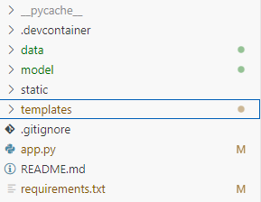

3.	Crea una aplicación Flask en un archivo Python, en app.py.
Importa Flask y otras bibliotecas necesarias.

```python
from flask import Flask, render_template, request
import pandas as pd
import pickle
Carga el modelo de regresión entrenado utilizando joblib.load().
app = Flask(__name__)
# Cargar el modelo
model = pickle.load(open('model/model_regresion.pkl', 'rb'))
```
4.	Define rutas para la aplicación, como la ruta raíz ("/") y cualquier otra ruta necesaria para manejar las solicitudes.

```python
# Cargar el dataframe
df_juegos = pd.read_csv('data/df_juegos.csv')
# Cargar las columnas del modelo de entrenamiento
with open('model/X_train.pkl', 'rb') as f:
    model_columns = pickle.load(f)
```

5.	En la función de manejo de la solicitud, realiza la predicción utilizando el modelo de regresión cargado y los datos proporcionados en la solicitud.

```python
@app.route('/')
def home():
    generos = df_juegos['Genero'].unique().tolist()
    plataformas = df_juegos['Plataforma'].unique().tolist()
    companias = df_juegos['Compañia_Desarrollo'].unique().tolist()
    
    return render_template('index.html', generos=generos, plataformas=plataformas, companias=companias)

```
6.	Devuelve el resultado de la predicción como una respuesta HTTP.

```python
@app.route('/predict', methods=['POST'])
def predict():
    # Recibir los datos del formulario
    genero = request.form['genero']
    plataforma = request.form['plataforma']
    compania = request.form['compania']
    
    # Crear un dataframe con los datos recibidos
    nuevo_juego = pd.DataFrame({
        'Genero': [genero],
        'Plataforma': [plataforma],
        'Compañia_Desarrollo': [compania]
    })

    # Convertir las características categóricas a numéricas
    nuevo_juego = pd.get_dummies(nuevo_juego)
    nuevo_juego = nuevo_juego.reindex(columns=model_columns, fill_value=0)

    # Hacer la predicción
    ventas_predichas = model.predict(nuevo_juego)
# Generar el mensaje
    if ventas_predichas[0] >= 0.548394:
        mensaje = "La predicción sugiere que el juego será exitoso"
    else:
        mensaje = "Alguna de las características seleccionadas no cumplen con los requisitos para que el juego sea exitoso"

    return render_template('result.html', prediction=ventas_predichas[0], mensaje=mensaje)

if __name__ == '__main__':
    app.run(debug=True, port=5002)

```

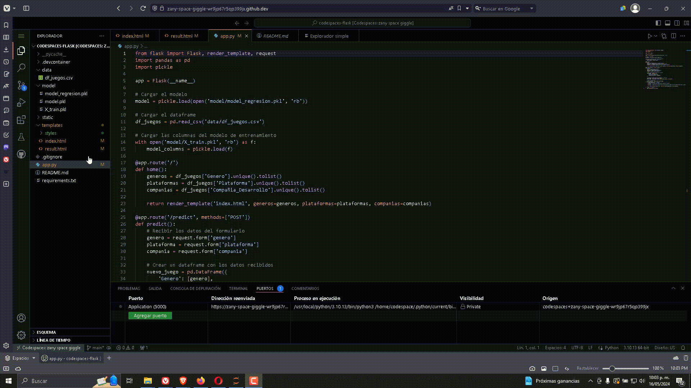

---

7.	Creación de plantillas HTML:
Crea plantillas HTML para la interfaz de usuario de tu aplicación con la carga de index.html para la captura de las variables "Genero", "Plataforma” y "Empresa de Desarrollo”.


```HTML
<body>
    <div class="logo"></div>
    <h1>Introduce los detalles del juego</h1>
    <form action="/predict" method="post">
        <label for="genero">Género:</label>
        <select name="genero" id="genero">
            
                <option value="{{ genero }}">{{ genero }}</option>
            
        </select>
        <label for="plataforma">Plataforma:</label>
        <select name="plataforma" id="plataforma">
            
                <option value="{{ plataforma }}">{{ plataforma }}</option>
            
        </select>
        <label for="compania">Compañía de Desarrollo:</label>
        <select name="compania" id="compania">
            
                <option value="{{ compania }}">{{ compania }}</option>
            
        </select>
        <input type="submit" value="Predecir Ventas">
    </form>
</body>

```

Utiliza etiquetas HTML para recoger la entrada del usuario, como formularios o campos de texto.
Renderiza el resultado de la predicción en la plantilla HTML utilizando el motor de plantillas de Flask.

8.	Estilo y diseño de la interfaz de usuario:
Utiliza CSS para diseñar y estilizar la interfaz de usuario de tu aplicación.


```CSS
<style>
body {
    font-family: Arial, sans-serif;
    background-color: #f6f8fa;
    margin: 0;
    padding: 0;
    display: flex;
    flex-direction: column;
    align-items: center;
}
h1 {
    color: rgba(248, 173, 59, 1.0);
    text-align: center;
    margin-bottom: 20px;
}
.logo {
    background-image: url('https://d2j6dbq0eux0bg.cloudfront.net/images/43093237/3601039288.png');
    background-size: contain;
    background-repeat: no-repeat;
    width: 200px; /* Ajusta el ancho según sea necesario */
    height: 100px; /* Ajusta la altura según sea necesario */
    margin-bottom: 20px;
}
form {
    background-color: #fff;
    padding: 30px;
    border-radius: 10px;
    box-shadow: 0 4px 8px rgba(0, 0, 0, 0.1);
    max-width: 500px;
    margin: 20px auto;
}
label {
    display: block;
    margin-bottom: 10px;
    color: rgba(248, 173, 59, 1.0); /* Color de texto */
}
select,
input[type="submit"] {
    width: calc(100% - 22px);
    padding: 12px;
    margin-bottom: 20px;
    border: 1px solid #d1d5da;
    border-radius: 8px;
    box-sizing: border-box;
    color: rgba(248, 173, 59, 1.0); /* Color de texto */
}
input[type="submit"] {
    background-color: rgba(248, 173, 59, 1.0); /* Color de fondo del botón */
    color: #fff;
    cursor: pointer;
    transition: background-color 0.3s ease;
}
input[type="submit"]:hover {
    background-color: rgba(218, 148, 0, 1.0); /* Cambio de color al pasar el mouse */
}
/* Agregar un efecto de sombra al enfocar los campos */
input:focus,
select:focus {
    box-shadow: 0 0 8px rgba(3, 102, 214, 0.5);
    outline: none;
}
</style>
```


9.	Accede a tu aplicación web a través de un navegador web visitando la URL proporcionada por Flask.


10.	Despliegue:
Despliega tu aplicación web en un servidor para que esté disponible públicamente a traves de un archivo html llamado result.html.

```HTML
<body>
    <div class="logo"></div>
    <h2>El promedio total de ventas globales para todas las plataformas es: 548394</h2>
    <h1>{{ mensaje }}</h1>    
    <h3>El resultado de la predicción es: {{ prediction*1000000}} </h3>   
    <a href="/">Volver a la página de inicio</a>
</body>

```
Se considera utilizar el servicio de alojamiento en la nube de github Code Spaces para el despliegue del resultado.

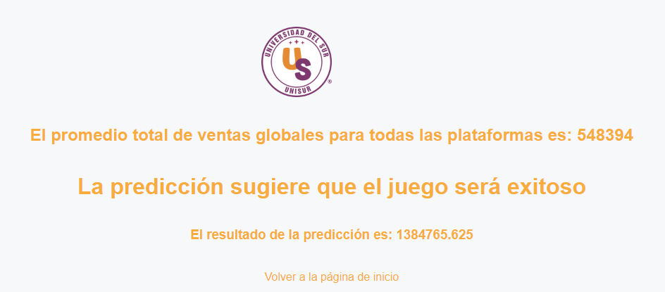


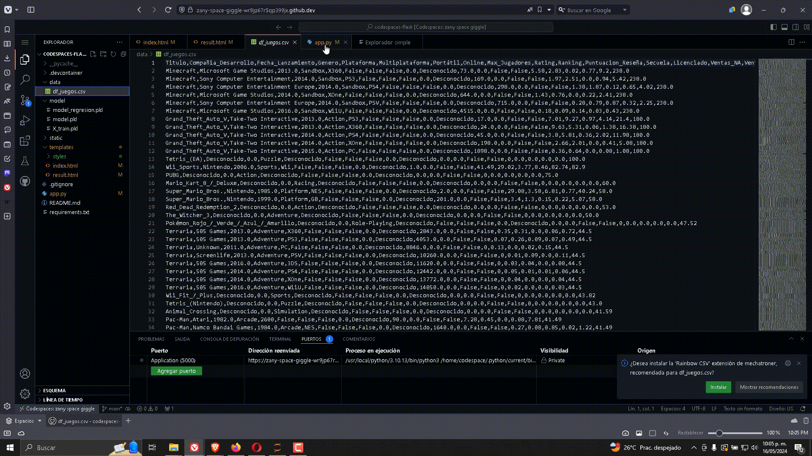

---

## 6 Análisis exploratorio de Datos (AED)

En el análisis exploratorio se analizan los DataFrames con la información proporcionada en la sección anterior, el propósito es analizar e investigar los conjuntos de datos, resumir sus características principales, identificar relaciones, entender la distribución de la(s) variables(s) objetivo(s) y las variables para conseguir el objetivo del proyecto.

Se define a realizar lo siguiente:

- #### Análisis de Ventas Globales por año.
- #### Análisis de Correlación de Ventas Globales por Consola y Genero.
- #### Análisis de Ventas Globales de Videojuegos por Plataforma.
- #### Análisis de Ventas Globales por Género.
- #### Análisis de Ventas Globales por Compañía de Desarrollo.
---

## 6.1 Análisis de Ventas Globales por año.

En este análisis, se examina la distribución de las ventas de videojuegos a nivel global a lo largo de los años utilizando el atributo 'Fecha_Lanzamiento' que contiene la información de la fecha en que se lanzó a la venta del videojuego y el atributo 'Ventas_Globales' que contiene la información del total de ventas globales del videojuego, por lo que la relación de las ventas globales con el año de lanzamiento se visualiza en un gráfico lineal.
El objetivo es identificar patrones o tendencias en las ventas a lo largo del tiempo, como picos o declives en ciertos años. Esto puede ayudar a comprender la evolución de la industria de los videojuegos y tomar decisiones estratégicas basadas en las ventas históricas.

---


```python
# Ventas globales por año
df_juegos_validos = df_juegos[df_juegos['Fecha_Lanzamiento'] != 0]
ventas_por_año = df_juegos_validos.groupby('Fecha_Lanzamiento')['Ventas_Globales'].sum()

# Gráfico de líneas de ventas globales por año
plt.figure(figsize=(10,6))
ventas_por_año.plot(kind='line', linewidth=2, color='blue')  # La línea es ahora azul y más gruesa

# Obtén el año y las ventas del punto máximo
max_year = ventas_por_año.idxmax()
max_ventas = ventas_por_año[max_year]

# Grafica el punto máximo
plt.scatter([max_year], [max_ventas], color='red')  # Dibuja un punto rojo en el valor máximo

plt.title('Ventas Globales por Año')
plt.xlabel('Año de Lanzamiento')
plt.ylabel('Ventas Globales (en millones)')
plt.xlim([1980, 2017])  # Esto define el rango del eje X
plt.xticks(range(1980, 2018, 1), rotation=90)  # Esto establece los ticks de 1980 a 2017, de uno en uno
plt.grid(True)
plt.show()
```

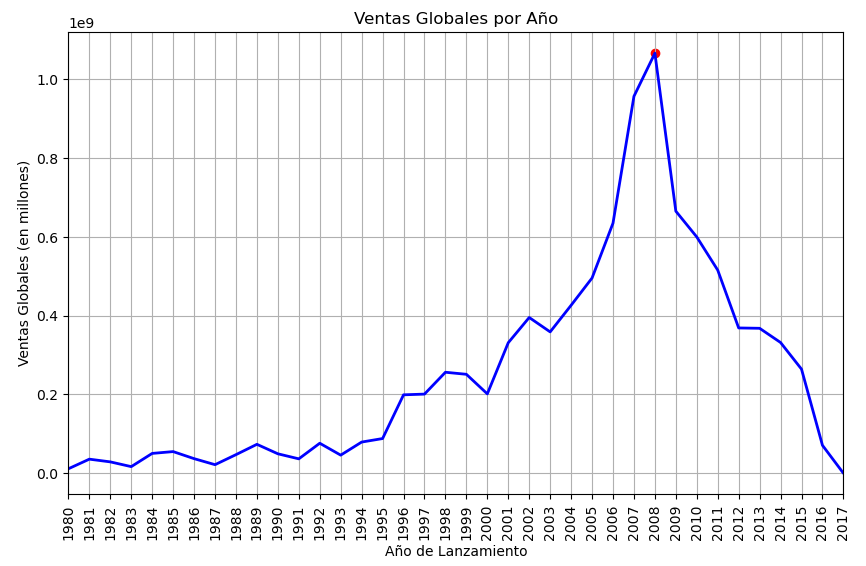

### 6.1.1 información relevante:

- El promedio de ventas globales tiene un promedio de 500000 mil copias en el lapso de 37 años.
- Los picos más altos de ventas Globales están entre 2007 y 2008.
- La tendencia de ventas incremento a partir del año 2000, pero a partir de 2015 las ventas bajaron.

---

## 6.2 Análisis de Correlación de Ventas Globales por Consola y Genero.

Se puede explorar las correlaciones entre los diferentes atributos que se tienen en el DataFrame df_juegos para ayudar a entender mejor sus relaciones y seleccionar las características para el modelado de datos.

La matriz de correlación es una tabla que muestra el coeficiente de correlación (también conocido como Pearson's r) entre pares de variables en un conjunto de datos. Cada celda de la tabla muestra la correlación entre dos variables.

Las características de la matriz de correlación son:

- Coeficiente de correlación que es una medida estadística que describe el grado de relación entre dos variables.
- El coeficiente de correlación puede variar de -1 a +1.
- Una correlación de +1 indica una fuerte correlación positiva: esto significa que las dos variables tienden a aumentar juntas.
- Una correlación de -1 indica una fuerte correlación negativa: esto significa que a medida que una variable aumenta, la otra disminuye.
- Una correlación de 0 indica que no hay una relación lineal entre las variables.

---

```python
# Seleccionamos solo las columnas numéricas
numeric_df = df_juegos.select_dtypes(include=[np.number])

# Ahora calculamos la matriz de correlación solo con las columnas numéricas
correlation_matrix = numeric_df.corr()
# Suponiendo que 'df' es tu DataFrame y 'correlation_matrix' es la matriz de correlación que has calculado
plt.figure(figsize=(15,10))
sns.heatmap(correlation_matrix, annot=True)
plt.title('Correlation matrix of DataFrame')
plt.xticks(rotation=90)
plt.yticks(rotation=0)
plt.show()
```

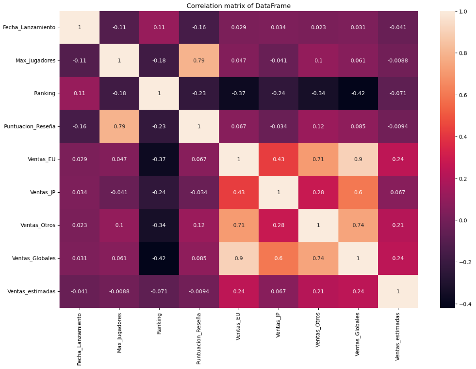

Al visualizar la matriz de correlación con el mapa de calor, se puede obtener una vista de cómo están correlacionadas las variables en el conjunto de datos del DataFrame df_juegos.

En el mapa de calor:

- Las celdas coloreadas representan las correlaciones entre las variables.
- El color de cada celda se determina según el valor de correlación y el mapa de color que se utiliza.
- Las correlaciones fuertes (cercanas a 1 o -1) se indican con colores más intensos, mientras que las correlaciones débiles (cercanas a 0) se indican con colores más claros.

**Se visualiza una fuerte correlación positiva entre las 'Ventas_Globales', 'Ranking' y la 'Puntuacion_Reseña', por lo que se puede inferir que los videojuegos con puntuaciones de reseñas más altas tienden a tener más ventas globales. Esto sugiere que la calidad de un juego (según lo medido por las reseñas) puede influir en su éxito comercial. Sin embargo, la correlación no implica causalidad y se va necesita más investigación para entender la relación entre estas variables.**

---

### 6.2.1 Relación entre Genero y Ventas Globales**

Para profundizar en el análisis de correlación, se va a graficar las relaciones entre tres variables: 'Plataforma', 'Ventas_Globales', y 'Genero'. La variable 'Plataforma' se muestra a lo largo del eje x, la variable 'Ventas_
Globales' se muestra a lo largo del eje y, y la variable 'Genero' se representa mediante el color de los puntos.

Por lo tanto, cada punto en el gráfico representa un juego, y su posición en el eje x y y indica la plataforma en la que se lanzó el juego y las ventas Globales que tuvo. El color del punto indica el género del juego.

Se observa en cada punto del gráfico cómo las ventas en Globales varían según la plataforma y el género.

---

```python
# Ajustar el tamaño de la figura
plt.figure(figsize=(20,8))

# Crear un scatterplot 2D donde la tercera variable ('Genero') se representa mediante el color de los puntos
sns.scatterplot(data=df_juegos, x='Genero', y='Ventas_Globales', hue='Plataforma')

plt.title('Relacion entre Genero y Ventas Globales')
plt.xlabel('Genero')
plt.ylabel('Ventas de Globales (en millones)')

# Rotar las etiquetas del eje x a 45 grados para una mejor legibilidad
plt.xticks(rotation=90, ha='right')  
plt.yticks(rotation=0)   
plt.grid(True)
plt.show()
```
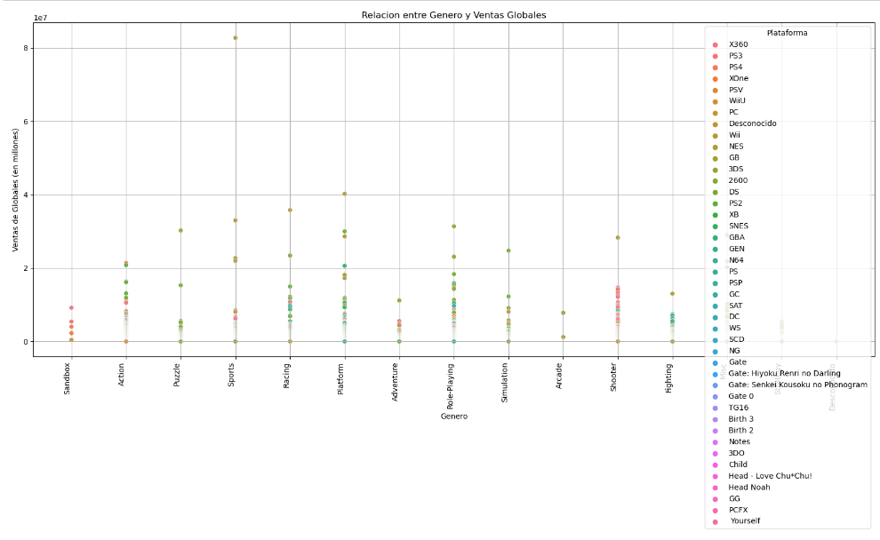

Los puntos de un color específico (videojuegos de un cierto género) están concentrados en una cierta área del gráfico, sugiere que el género tiende a tener más ventas en determinadas plataformas.

### 6.2.2 información relevante:
- **El promedio de ventas globales de cada genero están por debajo de las 10 millones de copias, por lo tanto, es de sugerir hacer una análisis de los promedios de ventas globales por genero y/o plataforma.**
- Los géneros que más venden son el de Accion, Racing, Platform, Role Playing y Shooter.
- Las plataformas que más venden por genero son:
  - Accion (Nintendo, Play Station y Xbox).
  - Racing (Nintendo, Play Station y Xbox).
  - Accion (Nintendo, Play Station y Xbox).
  - RPG (Nintendo, Play Station y Xbox).
  - Shooter (Play Station y Xbox).
  
  ---

## 6.3 Análisis de Ventas Globales de Videojuegos por Plataforma.

Resultado del análisis de correlación anterior, se puede observar que la relación entre las 'Ventas_Globales', 'Genero' y 'Plataforma' está por debajo de 1 millón de copias, por lo tanto, se va realizar una análisis de la media de 'Ventas_Globales.

En este análisis, se examina la distribución de las ventas de videojuegos según la plataforma en la que se juegan, utilizando el atributo 'Plataforma' que contiene la información de la plataforma en la que se ejecuta el videojuego y el atributo 'Ventas_Globales' que contiene la información del total de ventas globales del videojuego, por lo que la relación puede calcular el total de ventas por Plataforma y visualizar esta información en un gráfico lineal marcando cada punto máximo en el atributo 'Plataforma' de los videojuegos más populares o exitosos en términos de ventas. Esto puede ser útil para comprender el mercado de consolas y tomar decisiones sobre el desarrollo y la distribución de juegos específicos para ciertas plataformas.


---

**Se va calcular y obtener la media de Ventas Globales por cada Plataforma.**

---

```python
# Calcular la media de 'Ventas_Globales' para cada 'Plataforma'
media_ventas_por_plataforma = df_juegos.groupby('Plataforma')['Ventas_Globales'].mean()

# Calcular la media de 'Ventas_Globales' para cada 'Genero'
media_ventas_por_genero = df_juegos.groupby('Genero')['Ventas_Globales'].mean()
```

---

Se grafica las ventas globales por plataforma del mayor al menor.

---

```python
# Ordenar media_ventas_por_plataforma del promedio más alto al más bajo
media_ventas_por_plataforma_sorted = media_ventas_por_plataforma.sort_values(ascending=False)

# Crear un gráfico de barras para media_ventas_por_plataforma_sorted
media_ventas_por_plataforma_sorted.plot(kind='bar', figsize=(12, 6))
plt.title('Promedio de Ventas Globales por Plataforma')
plt.ylabel('Promedio de Ventas Globales')
plt.xlabel('Plataforma')
plt.xticks(rotation=90)
plt.grid(True)
plt.show()
```
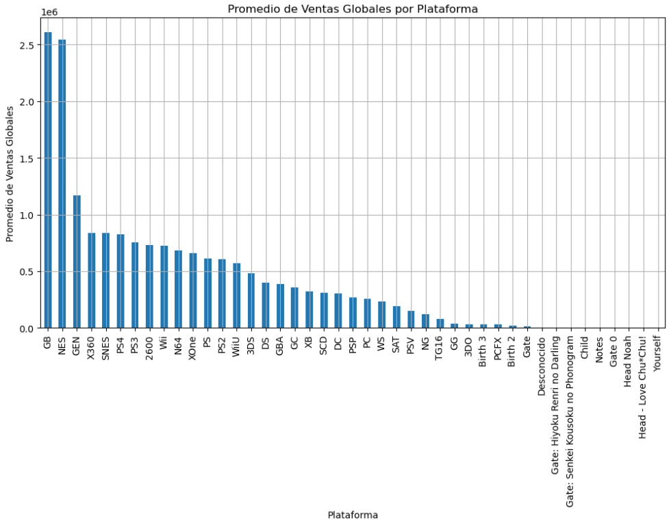

```python
# Calcular el promedio total de ventas globales
promedio_total_ventas_globales = df_juegos['Ventas_Globales'].mean()*1000000

# Imprimir el resultado
print(f"El promedio total de ventas globales para todas las plataformas es: {promedio_total_ventas_globales}")
```
**El promedio total de ventas globales para todas las plataformas es: 548394067325.8527**

---

### 6.3.1 información relevante:
- El promedio de ventas globales por plataforma están por debajo de 1 millón de copias.
- El promedio total de ventas globales para todas las plataformas es de 548394 millones de copias.
- Las plataformas que más venden son de Nintendo, Play Station y Xbox.

---

## 6.4 Análisis de Ventas Globales por Género.
En este análisis, se examina la distribución de las ventas de videojuegos a nivel global utilizando el atributo 'Genero' que contiene la información del género del videojuego y el atributo 'Ventas_Globales' que contiene la información del total de ventas globales del videojuego, por lo que la relación puede calcular el total de ventas por género y visualizar esta información en un gráfico lineal marcando cada punto máximo en el atributo 'Genero' de videojuegos más populares o exitosos en términos de ventas. Esto puede ser útil para tomar decisiones relacionadas con el desarrollo y la comercialización de nuevos juegos, así como para comprender los intereses y preferencias de los jugadores.

```python
# Ordenar media_ventas_por_plataforma del promedio más alto al más bajo
media_ventas_por_genero_sorted = media_ventas_por_genero.sort_values(ascending=False)
# Crear un gráfico de barras para media_ventas_por_genero
media_ventas_por_genero_sorted.plot(kind='bar', figsize=(12, 6))
plt.title('Promedio de Ventas Globales por Genero')
plt.ylabel('Promedio de Ventas Globales')
plt.xlabel('Genero')
plt.xticks(rotation=90)
plt.grid(True)
plt.show()
```

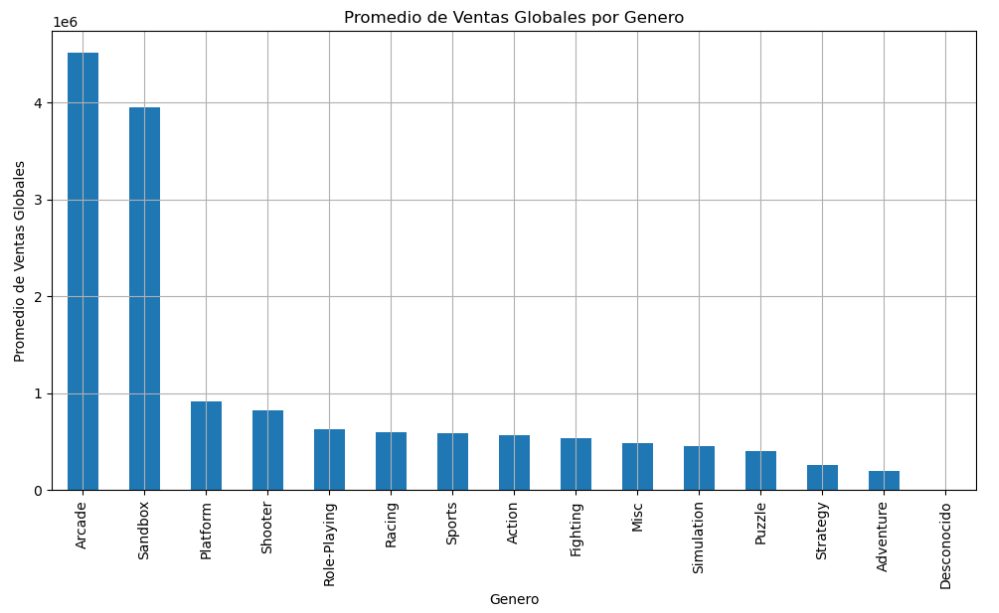

### 6.4.1 información relevante:

- El promedio de ventas globales por genero están por debajo de 1 millones de copias.
- El promedio total de ventas globales para todos los Géneros es de 548394 millones de copias.
- Los Géneros que más venden son:
  - Arcade.
  - SandBox.
  - Platform.
  - Shooter.
  - RPG.
  - Racing.
  - Sports.
  - Accion.
  
  ---

  ## 6.5 Análisis de Ventas Globales por Compañía de Desarrollo.

En este análisis, se examina la distribución de las ventas de videojuegos a nivel global según la compañía de desarrollo de los juegos, utilizando el atributo 'Compañia_Desarrollo' que contiene la información de la compañía que desarrollo el videojuego y el atributo 'Ventas_Globales' que contiene la información del total de ventas globales del videojuego, por lo que la relación puede calcular el total de ventas por compañía y visualizar esta información en un gráfico de lineal.
El objetivo es identificar qué compañías de desarrollo tienen mayor éxito en términos de ventas de videojuegos. Esto puede ser útil para evaluar la reputación y el rendimiento de las compañías de desarrollo y tomar decisiones sobre asociaciones o adquisiciones en la industria.

---

```python
# Ventas globales por Compañia de Desarrollo
ventas_por_compañia = df_juegos.groupby('Compañia_Desarrollo')['Ventas_Globales'].sum().sort_values(ascending=False).head(22)

plt.figure(figsize=(12,6))
plt.plot(ventas_por_compañia.index, ventas_por_compañia.values, marker='o', linestyle='-')
plt.title('Ventas Globales por Compañía de Desarrollo')
plt.xlabel('Compañía de Desarrollo')
plt.ylabel('Ventas Globales (en millones)')
plt.xticks(rotation=90)
plt.grid(True)
plt.show()
```
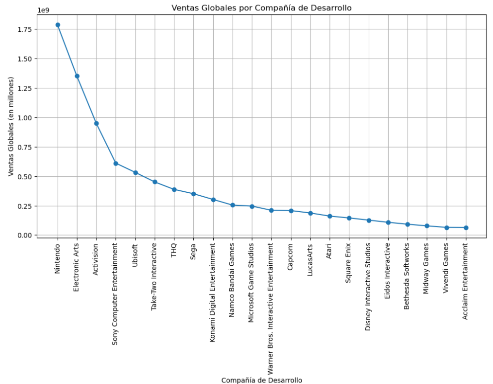

### 6.5.1 información relevante:

La mayoría de las Compañías de Desarrollo tienen un promedio de ventas Globales debajo de 500000 mil copias.
Las Compañías de Desarrollo que más venden son:
- Nintendo.
- Electroni Arts.
- Activision.
- Sony.
- Ubisoft.

---

# 7. Resultados de AED

Para relacionar los análisis al modelado de datos, se resume los puntos fuertes del tipo de análisis acorde con el objetivo del proyecto:


- **Análisis de Correlación de Ventas Globales por Consola y Genero:**

  - Se puede examinar la correlación entre los atributos del DataFrame df_juegos.
  - Se puede identificar la correlación positiva entre las 'Ventas_Globales', 'Ranking' y la 'Puntuacion_Reseña'.
  - Se puede evaluar qué que los videojuegos con puntuaciones de reseñas más altas tienden a tener más ventas globales y que se puede usar como variable objetivo para definir el Videojuego, considerando las reseñas y el ranking que el jugador puede tener al jugar un videojuego, y como este puede desarrollar una experiencia de juego enfocada a la experiencia educativa.
  - En conclusión, se pueden utilizar estos datos para determinar en qué género del videojuego se debe desarrollar el Videojuego.
  
  
  
- **Análisis de Ventas Globales de Videojuegos por Plataforma:**

  - Se puede examinar la distribución de las ventas de videojuegos según la plataforma o consola en la que se juegan.
  - Se puede identificar qué plataformas son más populares en términos de ventas.
  - Se puede evaluar qué plataformas son más adecuadas para el Videojuego, considerando las características técnicas y de usabilidad requeridas para ofrecer una experiencia educativa efectiva.
  - En conclusión, se pueden utilizar estos datos para determinar en qué plataformas se debe desarrollar y distribuir el Videojuego.
  
  
  

- **Análisis de Ventas Globales por Género:**
  - Se puede examinar la distribución de las ventas de videojuegos según el género.
  - Se puede identificar los géneros de videojuegos más populares en términos de ventas.
  - Se puede evaluar qué géneros son relevantes para el Videojuego, considerando el objetivo educativo o informativo del juego.
  - En conclusión, se pueden utilizar estos datos para determinar qué género de Videojuego tiene un mayor potencial de aceptación y éxito en el mercado.
  
  
  

- **Análisis de Ventas Globales por Compañía de Desarrollo:**

  - Se puede examinar la distribución de las ventas de videojuegos según la compañía de desarrollo.
  - Se puede identificar qué compañías tienen un historial exitoso en términos de ventas de videojuegos.
  - Se puede evaluar posibles asociaciones o colaboraciones con estas compañías para el desarrollo y distribución del Videojuego.
  - En conclusión, se pueden utilizar estos datos para seleccionar una compañía de desarrollo con experiencia en el género de juegos y plataforma seleccionados.


Al combinar estos análisis, se puede obtener una visión más completa y respaldada por datos del tipo de género y plataforma más adecuados para el desarrollo del Videojuego. Estos análisis proporcionarán información sobre las preferencias de los jugadores, las tendencias del mercado y las oportunidades para lograr el éxito en términos de ventas y aceptación del juego. Y validar la implementacion del modelo predictivo en base al 'Genero', 'Plataforma' y 'Ventas_Globales' **"si el desarrollo de un Videojuego puede ser exitoso"**.

---


# 8. Conclusión

En el análisis de los datos, se evaluaron tres tipos diferentes de modelos predictivos: un modelo de clasificación, un modelo de regresión lineal y un modelo de regresión logística. Cada uno de estos modelos tiene su utilidad y es útil en diferentes contextos.

Sin embargo, en base a los resultados obtenidos y al objetivo específico de este proyecto, se concluye que el modelo de regresión lineal es el más adecuado para predecir las ventas globales de un videojuego basado en atributos como el género, la plataforma y la compañía de desarrollo del juego. Los otros dos modelos, de clasificación y regresión logística, demostraron tener dificultades para realizar predicciones precisas en el contexto de este problema, ya que tuvieron problemas el primero para predecir el género de un videojuego y el segundo para predecir si un videojuego fuera exitoso.

A pesar de que se obtuvieron algunos resultados útiles, se hace evidente que hay margen para mejorar estos modelos. En concreto, sería útil explorar otras características que podrían influir en las ventas globales de un videojuego, como la fecha de lanzamiento del juego, las calificaciones recibidas por el juego, o incluso la presencia de ciertos personajes o temáticas en el juego. También puede ser útil probar con diferentes tipos de modelos, como los árboles de decisión, máquinas de soporte de vectores o redes neuronales artificiales, que pueden ser más eficaces en ciertos contextos.

Asimismo, sería beneficioso recolectar más datos y posiblemente ajustar los parámetros de los modelos para mejorar la precisión de las predicciones. Sin embargo, la recolección de datos adicionales siempre debe hacerse de manera ética y con el consentimiento adecuado, y debe tenerse en cuenta que ajustar demasiado los modelos puede llevar a un sobreajuste, donde el modelo se desempeña muy bien en los datos de entrenamiento, pero mal en los datos de prueba.

En resumen, aunque el modelo de regresión lineal fue el que dio los mejores resultados en este proyecto, hay mucho margen para mejorar y explorar otras opciones. El análisis de datos y la modelización son procesos iterativos, y siempre hay espacio para aprender, mejorar y probar nuevas ideas.


---

# 9. Bibliográfia

- Documentación oficial de Python: https://docs.python.org/3/
- Documentación oficial de Pandas: https://pandas.pydata.org/docs/
- Documentación oficial de Matplotlib: https://matplotlib.org/stable/contents.html
- Documentación oficial de Seaborn: https://seaborn.pydata.org
- Documentación oficial de Scikit-learn: https://scikit-learn.org/stable/
- Documentación oficial de Numpy: https://numpy.org/doc/stable/
- Analisis Exploratorio de Datos https://www.aprendemachinelearning.com/analisis-exploratorio-de-datos-pandas-python/
- Conceptos en Python https://www.geeksforgeeks.org
- Dudas https://stackoverflow.com/questions/tagged/pandas+python
- Analisis de datos https://ocw.uc3m.es/course/view.php?id=230
- Diccionarios de datos en data frame https://github.com/nsheikh23/COVID_StockMarket_Analysis/blob/master/52_Week.ipynb
- Procesamiento de data frames en pandas https://barcelonageeks.com/eliminar-una-o-varias-columnas-de-pyspark-dataframe/
- Data Clean https://github.com/mramshaw/Data-Cleaning
- Ploteo de datos https://github.com/tomimester/python-histogram/blob/master/plot-histogram-python-pandas.ipynb
- Data Cleaning in Python: the Ultimate Guide (2020) https://towardsdatascience.com/data-cleaning-in-python-the-ultimate-guide-2020-c63b88bf0a0d
- Regresión lineal en Python: un análisis detallado https://www.cienciadedatos.net/documentos/py10-regresion-lineal-python.html
- Aplicando Machine Learning para predecir éxitos de videojuegos https://www.saturdays.ai/projects/Videojuegos.html
- Machine Learning para la predicción de ventas https://www.aprendemachinelearning.com/regresion-lineal-en-espanol-con-python/
- McKinney, Wes. Python for Data Analysis. O'Reilly Media, Inc, 2017.
- VanderPlas, Jake. Python Data Science Handbook: Essential Tools for Working with Data. O'Reilly Media, Inc, 2016.

---